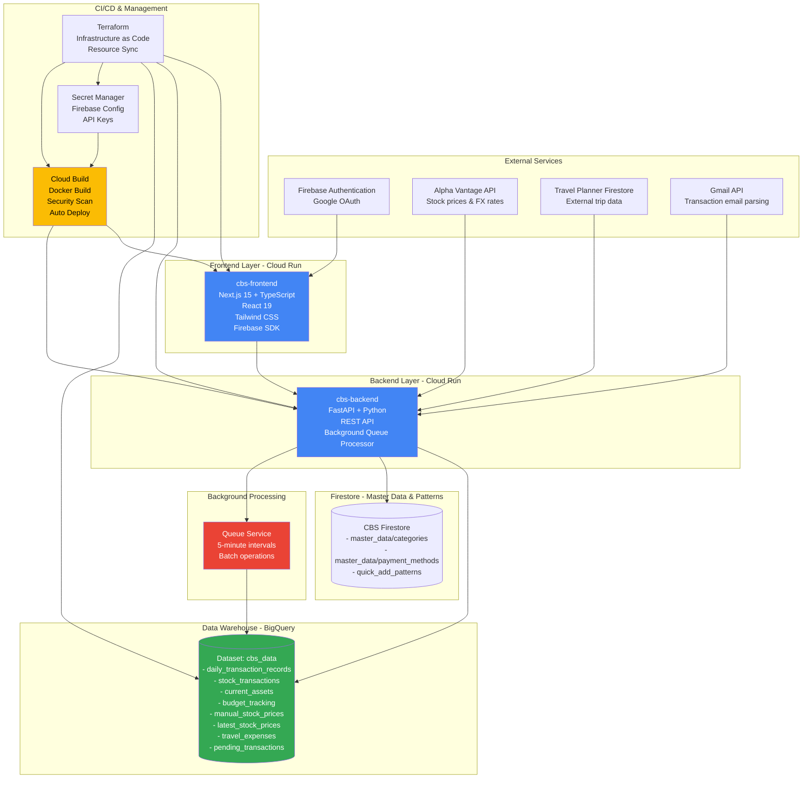
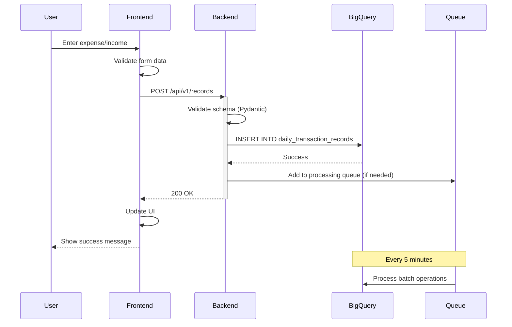
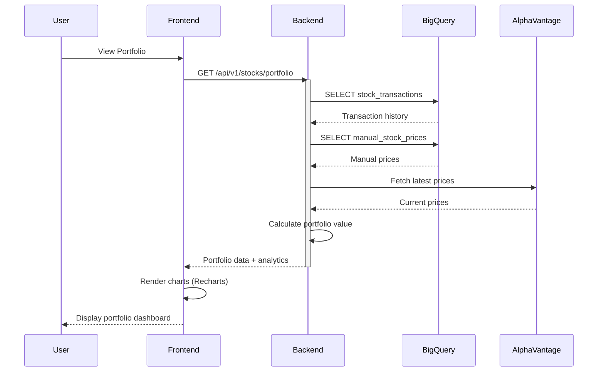
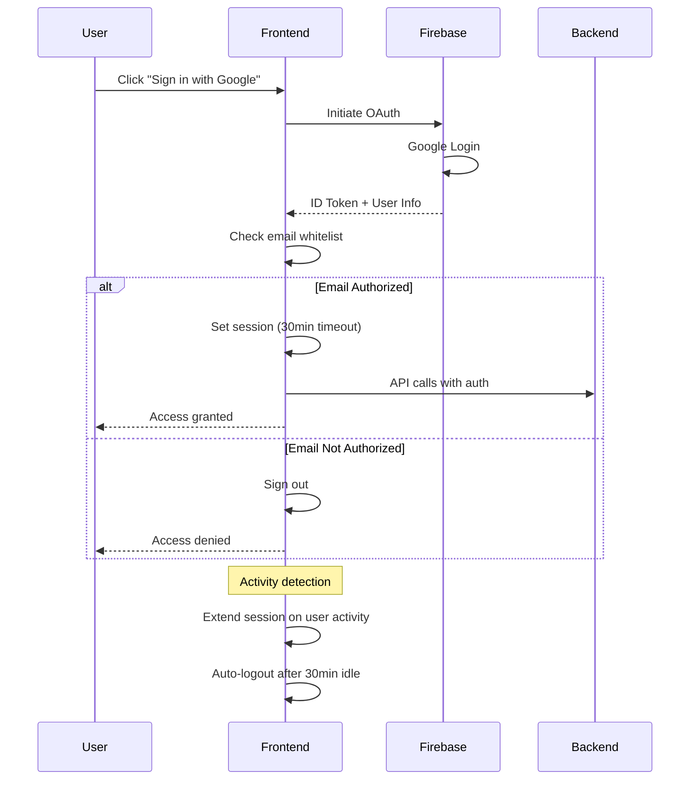

# Personal Finance Management System - Architecture Documentation

> Complete technical documentation for the personal finance management platform

---

## 🔒 Repository Status: Private Source Code

This repository hosts the architecture documentation and technical design specifications for the Personal Finance Management System.

Due to the inclusion of sensitive financial logic, personal configuration secrets, and proprietary algorithms, the actual source code is maintained in a private repository.

---

## Quick Navigation

| Section | Description |
|---------|-------------|
| [Architecture Overview](#architecture-overview) | System architecture and component relationships |
| [Service Catalog](#service-catalog) | All services and their details |
| [Data Flow](#data-flow) | How data flows through the system |
| [GCP Resources](#gcp-resources) | BigQuery, Cloud Run, and other GCP services |
| [API Endpoints](#api-endpoints) | REST API documentation |
| [Tech Stack](#tech-stack) | Technologies and frameworks |

---

## Architecture Overview

### High-Level Architecture



### Technology Stack

| Layer | Technology | Purpose |
|-------|-----------|---------|
| **Frontend** | Next.js 15 + React 19 + TypeScript | Modern, type-safe UI framework |
| **Styling** | Tailwind CSS 4 | Utility-first CSS with responsive design |
| **Authentication** | Firebase Auth + Google OAuth | Secure user authentication with email whitelist |
| **Backend** | FastAPI + Python 3.9+ | High-performance async REST API |
| **Data Warehouse** | BigQuery | Serverless, cost-optimized analytics database |
| **Visualization** | Recharts | Interactive financial charts and dashboards |
| **Deployment** | Cloud Run | Serverless container platform |
| **CI/CD** | Cloud Build + Docker | Automated build, scan, and deployment |
| **Secrets** | Secret Manager | Secure credential management |
| **IaC** | Terraform | 100% Infrastructure as Code management |
| **Master Data Storage** | Firestore | Dynamic categories, payment methods, quick add patterns |
| **External Integration** | Travel Planner (Firestore) | Travel trip data and expense tracking |
| **Email Automation** | Gmail API | Automated transaction detection from emails |

---

## Service Catalog

### 1. Frontend Application

| Property | Value |
|----------|-------|
| **Name** | project-2b-cbs-v1-frontend |
| **Repository** | `project-2b-cbs` (private) |
| **Deployment** | Cloud Run (asia-northeast1) |
| **Framework** | Next.js 15.5.2 + React 19 |
| **Language** | TypeScript 5 |
| **Build Tool** | Turbopack (Next.js) |
| **Responsibility** | User-facing dashboard for personal finance management |

**Key Features:**
- **Authentication**: Firebase Google OAuth with email whitelist
- **Session Management**: 30-minute idle timeout with activity detection
- **Responsive Design**: Mobile-first approach with glassmorphism UI
- **Real-time Charts**: Recharts integration for portfolio and expense visualization
- **Multi-Currency**: JPY/USD support with exchange rate handling

**Pages & Components:**
- Dashboard (BudgetWatcher)
- Daily Entry Form (Expense/Income tracking with Quick Add patterns)
- Expense Browser (Search & filter transactions)
- Stock Portfolio (Investment tracking)
- Listings Manager (Asset management)
- Advanced Analytics (Financial insights)
- Travel Expense Tracker (Trip-linked expense management)
- Pending Transactions (Gmail-fetched transaction review)
- CSV Upload (Bulk transaction import)
- AI Chat (SQL Agent natural language data analysis)

### 2. Backend API

| Property | Value |
|----------|-------|
| **Name** | project-2b-cbs-v1-api |
| **Repository** | `project-2b-cbs` (private) |
| **Deployment** | Cloud Run (asia-northeast1) |
| **Framework** | FastAPI |
| **Language** | Python 3.9+ |
| **Server** | Uvicorn (ASGI) |
| **Responsibility** | REST API for all business logic and data operations |

**Core Services:**
- `record_service.py` - Transaction CRUD operations
- `stats_service.py` - Analytics and aggregations
- `budget_service.py` - Budget tracking and alerts
- `stock_service.py` - Portfolio management
- `manual_stock_price_service.py` - Manual price entry for unlisted stocks
- `current_assets_service.py` - Asset snapshots and tracking
- `queue_service.py` - Retry queue for BigQuery operations
- `travel_expense_service.py` - Travel expense tracking with trip association
- `travel_planner_service.py` - External Travel Planner Firestore integration
- `master_data_service.py` - Dynamic categories and payment methods from Firestore (1hr cache)
- `csv_upload_service.py` - Bulk transaction import from CSV files
- `quick_add_service.py` - User-defined expense templates (Firestore)
- `merchant_categorizer.py` - AI-powered merchant name to category mapping
- `category_prediction_service.py` - RAG-based transaction categorization with hybrid prediction
- `vector_search_service.py` - Semantic similarity search using Vertex AI embeddings
- `correction_service.py` - User correction tracking for feedback loop
- `sentinel_service.py` - AI-powered portfolio monitoring with Google News RSS + Gemini LLM
- `notification_service.py` - Discord webhook notifications for portfolio alerts
- `auto_rule_generator.py` - Automated merchant rule proposals from frequent corrections

**Background Processing:**
- **Queue Service**: Handles failed UPDATE/DELETE operations caused by BigQuery streaming insert buffer
- **Retry Logic**: Automatic retry with exponential backoff (5 minutes initial, up to 5 attempts)
- **Use Case**: When data is inserted via `insert_rows_json()`, it remains in buffer for several seconds. Immediate UPDATE/DELETE operations fail during this period. Queue service defers these operations until data is committed to physical table.

### 3. BigQuery Data Warehouse

| Property | Value |
|----------|-------|
| **Project** | (Configured via GCP_PROJECT_ID) |
| **Dataset** | cbs_data |
| **Strategy** | Cost-optimized serverless analytics |
| **Cost Model** | Pay-per-query (no 24/7 VM costs) |

**Design Philosophy:**
This application uses **BigQuery instead of PostgreSQL** for strategic reasons:
- 💰 **Cost Efficiency**: No persistent VM costs, pay only for queries
- 🚀 **Serverless**: Zero infrastructure maintenance
- 📊 **Analytics-Ready**: Built-in data warehouse capabilities
- 🔧 **Scalability**: Automatic scaling without capacity planning

For a personal finance app with moderate transaction volume, BigQuery's pay-per-query model is significantly more cost-effective than maintaining a persistent database instance.

---

## Automated Operations

### Stock Price Data Pipeline

| Property | Value |
|----------|-------|
| **Automation** | GitHub Actions |
| **Schedule** | Daily at 8:00 AM JST (UTC 23:00) |
| **Trigger** | Cron-based + Manual dispatch |
| **Script** | `latest_stock_price_fetcher.py` |
| **Data Source** | Alpha Vantage API |
| **Targets** | Stock prices (GOOG, AAPL, MSFT, META, AMZN, NVDA) + USD/JPY exchange rate |
| **Storage** | BigQuery `latest_stock_prices` table |
| **Monitoring** | Email notification on pipeline failure |
| **Logging** | Execution logs retained for 30 days |

**Pipeline Flow:**
1. GitHub Actions triggers Python script daily
2. Fetch latest stock prices from Alpha Vantage API
3. Fetch USD/JPY exchange rate
4. Calculate JPY-denominated prices
5. Insert data into BigQuery via streaming insert
6. Upload execution logs as artifacts
7. Send email notification if any step fails

**Operational Benefits:**
- **Zero-maintenance**: Fully automated with no manual intervention
- **Cost-effective**: GitHub Actions free tier + serverless execution
- **Reliable**: Automatic retry on transient failures
- **Auditable**: 30-day log retention for troubleshooting

---

### Gmail Transaction Automation

| Property | Value |
|----------|-------|
| **Automation** | Manual trigger or scheduled |
| **Script** | `gmail_transaction_fetcher.py` |
| **Data Source** | Gmail API (ANA Pay, Revolut emails) |
| **Target Emails** | Payment confirmation emails from supported merchants |
| **Storage** | BigQuery `pending_transactions` table |
| **Workflow** | Fetch → Parse → Categorize → Pending Review → User Approval |
| **AI Integration** | Merchant categorization with confidence scoring |

**Pipeline Flow:**
1. Gmail API fetches payment confirmation emails
2. Parse email content to extract transaction details (merchant, amount, date)
3. AI-powered merchant categorizer suggests category with confidence score
4. Insert into `pending_transactions` table with `is_submitted = FALSE`
5. Frontend displays pending transactions for user review
6. User approves/edits transaction details
7. Move to `daily_transaction_records` with `is_submitted = TRUE`

**Key Features:**
- **Duplicate Detection**: Uses `source_email_id` (Gmail message ID) to prevent duplicates
- **Confidence Scoring**: AI categorization includes confidence level (0.0-1.0)
- **Multi-Source Support**: Handles different email formats (ANA Pay, Revolut, etc.)
- **User Review Workflow**: All auto-fetched transactions require explicit user approval

---

### RAG-Based Category Prediction System

| Property | Value |
|----------|-------|
| **System Type** | Hybrid RAG (Retrieval-Augmented Generation) |
| **Components** | Keyword matching + Vector search + BigQuery + LLM |
| **Embedding Model** | Vertex AI `text-embedding-004` (768 dimensions) |
| **Vector Store** | Firestore (`transaction_embeddings` collection) |
| **LLM** | Gemini API for final prediction |
| **Dataset Size** | 6K+ transaction embeddings |
| **Cost** | ~$0.17 for full dataset embedding generation |

**Prediction Flow:**

1. **Keyword Matching** (High Priority)
   - Check `merchant_mappings.yaml` for exact/pattern matches
   - If confidence ≥ 0.9, return immediately
   - Examples: "Seven Elevn" → Food & Drink/Foods (confidence: 1.0)

2. **Vector Search** (Semantic Similarity)
   - Generate query embedding: `f"商品名: {item_name}, 金額: {amount}円"`
   - Fetch all embeddings from Firestore
   - Calculate cosine similarity with NumPy
   - Return top 5 results with similarity ≥ 0.5
   - Example: "Seven Elevn 500円" → Similar transactions with 0.76+ similarity

3. **BigQuery Context** (Historical Data)
   - Query similar transactions from `daily_transaction_records`
   - Provide additional context for LLM

4. **Gemini API** (Final Prediction)
   - Combine vector search results + BigQuery examples
   - Generate final category prediction with reasoning
   - Return confidence score (0.0-1.0)

**Feedback Loop:**

- **Correction Tracking**: When users modify predicted categories, save to `prediction_corrections` table
- **Learning Mechanism**: 
  - Track correction frequency per item
  - Identify patterns in user corrections
  - Auto-generate keyword rules from frequent corrections (Self-Healing Pipeline)
- **Visual Indicators**: 
  - 🔧 = Hardcoded rule (confidence ≥ 0.9)
  - 🤖 = AI prediction (confidence < 0.9)

**Technical Implementation:**

| Component | Technology | Details |
|-----------|-----------|---------|
| **Embedding Generation** | Vertex AI | `text-embedding-004` model, 768-dim vectors |
| **Vector Storage** | Firestore | Document per transaction with embedding array |
| **Similarity Calculation** | NumPy | Cosine similarity in Python |
| **LLM Integration** | Gemini API | Context-augmented prompts |
| **Correction Storage** | BigQuery | `prediction_corrections` table |

**Performance Metrics:**

- **Query Latency**: ~1-2 seconds (embedding + search + LLM)
- **Similarity Threshold**: 0.5 minimum, 0.7+ considered high confidence
- **Cost Efficiency**: $0.00025 per 1,000 characters for embeddings

**Scripts:**

- `generate_embeddings.py` - Batch and incremental embedding generation for BigQuery transactions
- `auto_rule_generator.py` - Automated merchant rule proposals from frequent corrections
- `category_prediction_service.py` - Main prediction orchestration
- `vector_search_service.py` - Firestore vector search implementation
- `correction_service.py` - User correction tracking and retrieval
- `sql_agent_service.py` - Natural language to SQL agent with structured output orchestration

---

### Self-Healing Pipeline (Agentic RAG)

| Property | Value |
|----------|-------|
| **System Type** | Agentic Self-Healing Pipeline |
| **Components** | Auto Rule Generator + Discord HITL + Incremental Embeddings |
| **Scheduling** | Cloud Run Jobs + Cloud Scheduler (Terraform-managed) |
| **Approval** | Discord webhook notifications with Approve/Reject links |

**Pipeline Flow:**

1. **Correction Analysis** (Weekly - Sunday 07:00 JST)
   - Query `prediction_corrections` table for patterns with ≥3 corrections
   - Cross-reference with existing `merchant_mappings.yaml` rules
   - Generate new rule proposals for unmatched patterns

2. **Human-in-the-Loop Approval**
   - Save rule proposals to Firestore `pending_rules` collection
   - Send Discord notification with pattern details and Approve/Reject links
   - Approve: Add rule to `merchant_mappings.yaml` and mark as approved
   - Reject: Mark rule as rejected in Firestore

3. **Incremental Embedding Updates** (Monthly - 1st 07:00 JST)
   - Fetch existing embedding IDs from Firestore
   - Query BigQuery for new transactions not yet embedded
   - Generate embeddings for only new transactions (cost-optimized)
   - Store in Firestore `transaction_embeddings` collection

**Infrastructure:**

| Resource | Purpose | Schedule |
|----------|---------|----------|
| Cloud Run Job `auto-rule-generator` | Execute auto rule generation script | Weekly |
| Cloud Run Job `embedding-updater` | Execute incremental embedding script | Monthly |
| Cloud Scheduler `auto-rule-weekly` | Trigger auto rule job | `0 7 * * 0` |
| Cloud Scheduler `embedding-monthly` | Trigger embedding job | `0 7 1 * *` |

---

### SQL Agent with Structured Output

| System Type | Two-Step Reasoning & Formatting Pipeline |
|-------------|-------------------------------------------|
| **Core Engine** | LangChain `AgentExecutor` (SQL Agent) |
| **Structuring** | LLM `with_structured_output` (Pydantic) |
| **LLM** | Gemini 2.0 Flash (Fast & Accurate) |
| **Output Format** | Fixed JSON schema (answer, visualization_type, data, columns) |

**Processing Flow:**

1. **Step 1: Data Retrieval (SQL Agent)**
   - The agent analyzes the user's natural language question.
   - It autonomously generates and executes SQL queries against BigQuery.
   - It gathers raw results and formulates a human-readable explanation.

2. **Step 2: Structured Formatting (with_structured_output)**
   - The raw output from Step 1 is passed to a second LLM call configured with `with_structured_output`.
   - This step enforces a strict Pydantic-based schema, ensuring that values like `visualization_type` (table/chart/text) and `data` objects are 100% consistent.
   - The logic automatically detects when trend-based questions require 'chart' instead of 'table'.

**Key Benefits:**
- **Zero Parsing Errors**: Eliminates the need for fragile regex or text-based parsing of agent thought logs.
- **Frontend Synergy**: Guarantees that the data structure matches the frontend's expected properties for Recharts and Table components.
- **Improved Accuracy**: Separating "fact-finding" (SQL) from "presentation" (JSON formatting) allows the LLM to focus on one task at a time.

---

## Data Model

### Core Tables

| Table Name | Purpose | Key Columns |
|------------|---------|-------------|
| `daily_transaction_records` | All financial transactions | `transaction_id`, `recorded_date`, `transaction_type`, `price_jpy`, `item_category`, `item_subcategory`, `payment_method`, `is_waste`, `is_approved` |
| `stock_transactions` | Buy/Sell/Vest stock trades | `transaction_id`, `transaction_date`, `transaction_type`, `ticker_symbol`, `quantity`, `price_per_share`, `currency`, `commission_jpy` |
| `current_assets` | Asset snapshots | `asset_id`, `snapshot_date`, `service_provider`, `asset_name`, `asset_type`, `balance_jpy`, `balance_usd` |
| `budget_tracking` | Budget allocations | `budget_id`, `year_month`, `category`, `budget_amount`, `actual_amount` |
| `manual_stock_prices` | Unlisted stock prices | `ticker_symbol`, `price_date`, `price_usd`, `source` |
| `latest_stock_prices` | Latest stock price snapshots | `timestamp`, `symbol`, `price`, `usd_jpy_rate`, `price_jpy` |
| `travel_expenses` | Travel-specific expenses | `travel_expense_id`, `transaction_id`, `travel_id`, `travel_title`, `expense_date`, `item_name`, `item_category`, `price_jpy`, `local_currency`, `local_price`, `payment_method` |
| `pending_transactions` | Gmail-fetched transactions awaiting approval | `transaction_id`, `recorded_date`, `transaction_type`, `price_jpy`, `item_name`, `item_category`, `payment_method`, `is_submitted`, `source_type`, `source_email_id`, `confidence` |
| `prediction_corrections` | User corrections for AI predictions (feedback loop) | `correction_id`, `transaction_id`, `item_name`, `predicted_category`, `corrected_category`, `prediction_method`, `original_confidence`, `corrected_at` |

### Firestore Collections

| Collection | Purpose | Key Fields |
|------------|---------|------------|
| `master_data/categories` | Dynamic expense categories | `categories` (array), `updated_at` |
| `master_data/payment_methods` | Dynamic payment methods | `payment_methods` (array), `updated_at` |
| `quick_add_patterns/{userId}/patterns` | User expense templates | `pattern_name`, `item_category`, `item_subcategory`, `payment_method`, `price_jpy`, `order` |
| `transaction_embeddings` | Vector embeddings for RAG search | `transaction_id`, `item_name`, `embedding` (768-dim vector), `metadata` (category, subcategory, amount) |
| `pending_rules` | Auto-generated rule proposals awaiting HITL approval | `pattern`, `category`, `subcategory`, `count`, `status` (pending/approved/rejected), `created_at` |
| `travel_planner` (external) | Travel trips from Travel Planner app | `trip_id`, `title`, `start_date`, `end_date`, `destination` |

### Transaction Categories

**Expense Categories:**
- Housing (家賃・住宅)
- Utilities (水道光熱費)
- Food & Dining (食費・外食)
- Transportation (交通費)
- Healthcare (医療費)
- Entertainment (娯楽費)
- Shopping (買い物)
- Subscriptions (サブスク)
- Others (その他)

**Payment Methods:**
- Credit Card (クレジットカード)
- Cash (現金)
- Bank Transfer (銀行振込)
- E-money (電子マネー)
- Debit Card (デビットカード)

---

## Data Flow

### Transaction Entry Flow



### Portfolio Management Flow



### Authentication Flow



---

## API Endpoints

### Records API (`/api/v1/records`)

| Method | Endpoint | Description |
|--------|----------|-------------|
| POST | `/records` | Create single transaction |
| POST | `/records/bulk` | Bulk transaction insert |
| GET | `/records` | Get all transactions (with filters) |
| GET | `/records/{transaction_id}` | Get specific transaction |
| PUT | `/records/{transaction_id}` | Update transaction |
| DELETE | `/records/{transaction_id}` | Delete transaction |
| GET | `/records/search` | Advanced search with filters |

### Stats API (`/api/v1/stats`)

| Method | Endpoint | Description |
|--------|----------|-------------|
| GET | `/stats/monthly-summary` | Monthly expense/income summary |
| GET | `/stats/category-breakdown` | Spending by category |
| GET | `/stats/trends` | Historical trends and patterns |
| GET | `/stats/waste-analysis` | Waste spending analysis |

### Budget API (`/api/v1/budget`)

| Method | Endpoint | Description |
|--------|----------|-------------|
| POST | `/budget` | Create budget allocation |
| GET | `/budget/{year}/{month}` | Get monthly budget |
| PUT | `/budget/{budget_id}` | Update budget |
| GET | `/budget/tracking` | Budget vs actual comparison |

### Stocks API (`/api/v1/stocks`)

| Method | Endpoint | Description |
|--------|----------|-------------|
| POST | `/stocks/transaction` | Record stock trade |
| GET | `/stocks/portfolio` | Get portfolio summary |
| GET | `/stocks/holdings` | Current holdings |
| GET | `/stocks/performance` | Portfolio performance metrics |
| GET | `/stocks/history` | Transaction history |

### Manual Stock Prices API (`/api/v1/manual-stock-prices`)

| Method | Endpoint | Description |
|--------|----------|-------------|
| POST | `/manual-prices` | Add manual stock price |
| GET | `/manual-prices/{ticker}` | Get price history |
| PUT | `/manual-prices/{price_id}` | Update price entry |

### Current Assets API (`/api/v1/current-assets`)

| Method | Endpoint | Description |
|--------|----------|-------------|
| POST | `/assets` | Create asset record |
| GET | `/assets` | Get all current assets |
| GET | `/assets/snapshot/{date}` | Get assets as of date |
| PUT | `/assets/{asset_id}` | Update asset |
| DELETE | `/assets/{asset_id}` | Delete asset |

### Travel API (`/api/v1/travel`)

| Method | Endpoint | Description |
|--------|----------|-------------|
| GET | `/trips` | Get available travel trips from Travel Planner |
| GET | `/expenses/{travel_id}` | Get expenses for specific trip |
| POST | `/expenses` | Add travel expense |
| GET | `/expenses/summary/{travel_id}` | Travel expense summary with category breakdown |

### Master Data API (`/api/v1/master-data`)

| Method | Endpoint | Description |
|--------|----------|-------------|
| GET | `/categories` | Get dynamic categories (cached 1hr) |
| GET | `/payment-methods` | Get dynamic payment methods (cached 1hr) |
| POST | `/cache/clear` | Clear master data cache |

### CSV Upload API (`/api/v1/csv`)

| Method | Endpoint | Description |
|--------|----------|-------------|
| POST | `/upload` | Bulk import transactions from CSV file |

### Quick Add API (`/api/v1/quick-add`)

| Method | Endpoint | Description |
|--------|----------|-------------|
| GET | `/patterns` | Get user's quick add patterns |
| POST | `/patterns` | Create new pattern |
| PUT | `/patterns/{id}` | Update pattern |
| DELETE | `/patterns/{id}` | Delete pattern |
| POST | `/patterns/reorder` | Reorder patterns (drag-and-drop) |

### Pending Transactions API (`/api/v1/pending`)

| Method | Endpoint | Description |
|--------|----------|-------------|
| GET | `/pending` | Get pending transactions awaiting approval |
| POST | `/approve` | Approve and move to daily_transaction_records |
| POST | `/approve-bulk` | Bulk approve multiple pending transactions |
| DELETE | `/pending/{id}` | Reject pending transaction |

---

## GCP Resources

### Cloud Run Services

| Service Name | Region | Min Instances | Max Instances | Memory | CPU | Port |
|--------------|--------|--------------|---------------|--------|-----|------|
| `project-2b-cbs-v1-api` | asia-northeast1 | 0 | 10 | 2GB | 1 | 8080 |
| `project-2b-cbs-v1-frontend` | asia-northeast1 | 0 | 10 | 512MB | 1 | 8080 |

### Cloud Run Jobs

| Job Name | Schedule | Purpose |
|----------|----------|--------|
| `auto-rule-generator` | Weekly (Sun 07:00 JST) | Auto rule generation from frequent corrections |
| `embedding-updater` | Monthly (1st 07:00 JST) | Incremental embedding updates for new transactions |

### BigQuery Dataset

**Project**: Configured via `GCP_PROJECT_ID` environment variable
**Dataset**: `cbs_data`
**Location**: Multi-region (US or EU depending on configuration)

**Tables:**
- `daily_transaction_records` - ~50KB-1MB (personal use)
- `stock_transactions` - ~10KB-100KB
- `current_assets` - ~5KB-50KB
- `budget_tracking` - ~1KB-10KB
- `manual_stock_prices` - ~1KB-10KB
- `latest_stock_prices` - ~5KB-50KB (historical snapshots)
- `travel_expenses` - ~10KB-100KB (linked to Travel Planner trips)
- `pending_transactions` - ~5KB-50KB (partitioned by created_at, clustered by is_submitted)

**Cost Optimization:**
- No partitioning needed for personal scale
- On-demand pricing model
- Estimated monthly cost: $0.50-$2.00 (query processing only)

### Cloud Build

**Trigger:**
- **Type**: Manual or webhook-based
- **Config**: `cloudbuild.yaml`
- **Steps**:
  1. Build frontend Docker image
  2. Push to Container Registry
  3. Security scan with Trivy (CRITICAL vulnerabilities only)
  4. Deploy to Cloud Run

**Build Configuration:**
```yaml
- Frontend build with Secret Manager integration
- Docker multi-stage builds for optimization
- Security scanning before deployment
- Automatic deployment on success
```

### Secret Manager

**Stored Secrets:**
- `NEXT_PUBLIC_VITE_CBS_APP_PASSWORD` - Application password
- `NEXT_PUBLIC_FIREBASE_API_KEY` - Firebase config
- `NEXT_PUBLIC_FIREBASE_AUTH_DOMAIN` - Firebase auth domain
- `NEXT_PUBLIC_FIREBASE_PROJECT_ID` - Firebase project
- `NEXT_PUBLIC_FIREBASE_STORAGE_BUCKET` - Firebase storage
- `NEXT_PUBLIC_FIREBASE_MESSAGING_SENDER_ID` - Firebase messaging
- `NEXT_PUBLIC_FIREBASE_APP_ID` - Firebase app ID

### External Integrations

**Travel Planner (Firestore):**
- **Connection**: External Firestore project for travel trip management
- **Project ID**: Configured via `TRAVEL_PLANNER_PROJECT_ID` environment variable
- **Service Account**: `travel-planner-serviceAccountKey.json`
- **Data Accessed**: Travel trips (title, dates, destinations)
- **Purpose**: Link expenses to specific travel trips for better expense categorization

**Gmail API:**
- **Authentication**: OAuth 2.0 with `credentials.json` and `token.pickle`
- **Scope**: `gmail.readonly` for fetching payment confirmation emails
- **Usage**: Automated transaction detection from ANA Pay, Revolut emails
- **Script**: `gmail_transaction_fetcher.py`

**CBS Firestore (Master Data):**
- **Connection**: Firestore client for dynamic configuration
- **Service Account**: `firebase-admin-serviceAccountKey.json`
- **Collections**: `master_data`, `quick_add_patterns`
- **Caching**: 1-hour cache for categories and payment methods
- **Purpose**: Eliminate hardcoded categories/payment methods, enable user customization

---

## Security & Authentication

### Firebase Authentication

**Provider**: Google OAuth
**Configuration**: Email whitelist for authorized access

**Features:**
- Social login with Google accounts
- Server-side email validation
- Session management with idle timeout
- Automatic sign-out after 30 minutes of inactivity
- Activity detection for session extension

**Implementation:**
```typescript
// AuthContext.tsx
- Context API for global auth state
- onAuthStateChanged listener
- Activity tracking with event listeners
- Automatic logout on idle timeout
```

### CORS Configuration

**Allowed Origins:**
- `http://localhost:5173` (Vite dev)
- `http://localhost:3000` (Next.js dev)
- `http://localhost:3001` (Alternative dev)
- Production frontend URL (Cloud Run deployment)

### Data Security

- **Encryption**: All data encrypted at rest (BigQuery default)
- **Transport**: HTTPS only (Cloud Run enforced)
- **Secrets**: Secret Manager for sensitive credentials
- **Access Control**: IAM-based permissions for GCP resources

---

## Deployment

### CI/CD Pipeline

**Trigger**: Git push to `main` branch
**Platform**: Cloud Build with automatic triggers
**Configuration**: `cloudbuild.yaml`

**Deployment Flow:**
1. Developer pushes code changes to repository
2. Cloud Build trigger automatically activates
3. Docker image build (frontend with Secret Manager integration)
4. Push image to Container Registry (`gcr.io`)
5. Security scan with Trivy (CRITICAL vulnerabilities only)
6. Deploy to Cloud Run (asia-northeast1)
7. Zero-downtime deployment with traffic migration

**Cloud Build Configuration:**
```yaml
steps:
  - Build frontend Docker image with build args
  - Push to gcr.io
  - Security scan (CRITICAL only)
  - Deploy to Cloud Run (asia-northeast1)
availableSecrets:
  - Firebase configuration (7 variables)
  - API keys
options:
  logging: CLOUD_LOGGING_ONLY
```

**CI/CD Features:**
- **Automated Deployments**: No manual intervention required
- **Secret Management**: Secure credential injection via Secret Manager
- **Security Scanning**: Pre-deployment vulnerability detection
- **Rollback Capability**: Cloud Run revision management
- **Zero-Downtime**: Traffic gradually migrates to new version

### Environment Variables

**Frontend:**
```bash
NEXT_PUBLIC_API_URL=<Backend API URL>
NEXT_PUBLIC_FIREBASE_* (7 variables)
NEXT_PUBLIC_VITE_CBS_APP_PASSWORD
```

**Backend:**
```bash
GCP_PROJECT_ID=your-project-id
BIGQUERY_DATASET_ID=cbs_data
```

---

## Cost Optimization Strategy

**Architecture Decision: Serverless vs Traditional**

| Approach | Monthly Cost | Operational Overhead | Scalability |
|----------|-------------|---------------------|-------------|
| Traditional (PostgreSQL + VM) | $25-50 | High (patching, scaling, backup) | Manual capacity planning |
| Serverless (BigQuery + Cloud Run) | $0.30-0.50 | Zero (fully managed) | Automatic (0 to N instances) |
| **Reduction** | **99%** | **Eliminated** | **Automatic** |

**Actual Cost Breakdown (Personal Use):**
- BigQuery: < $0.05/month (storage + queries)
- Cloud Run: $0/month (min instances = 0, pay-per-request)
- Artifact Registry: ~$0.20-0.40/month (shared with other projects)
- Secret Manager: $0.06/month (7 secrets)
- GitHub Actions: $0/month (free tier)
- **Total: ~$0.30-0.50/month**

**Key Decision Factors:**
1. **Pay-per-use pricing**: Eliminates idle infrastructure costs
2. **Auto-scaling from zero**: No capacity planning or over-provisioning
3. **Managed services**: Zero operational overhead (no patching, backups, monitoring)
4. **Cost predictability**: Linear cost scaling with usage

**Scalability Consideration:**
This architecture maintains the same cost efficiency at 10x scale. At 1,000 daily users, estimated cost would be $5-10/month vs $100-200/month for traditional architecture, demonstrating sustainable design decisions.

---

## Technical Highlights

### Frontend Engineering

**Type Safety:**
- 100% TypeScript coverage
- Strict type checking enabled
- Pydantic-style schema validation

**State Management:**
- React Context API for global state
- Custom hooks for reusable logic
- Session persistence with localStorage

**Performance:**
- Next.js Turbopack for fast builds
- Server-side rendering (SSR) support
- Optimized bundle size
- Lazy loading for components

**UI/UX:**
- Glassmorphism design pattern
- Responsive mobile-first layout
- Smooth animations and transitions
- Accessible form inputs

### Backend Engineering

**API Design:**
- RESTful endpoints with proper HTTP methods
- OpenAPI/Swagger auto-documentation
- Pydantic models for validation
- Async/await for I/O operations

**Data Layer:**
- BigQuery client library integration
- Parameterized queries (SQL injection prevention)
- Connection pooling
- Error handling and retries

**Background Processing:**
- Queue service with 5-minute intervals
- Lifespan management for task startup/shutdown
- Graceful error handling
- Batch operation optimization

### DevOps & Infrastructure

**Infrastructure as Code (IaC):**
- 100% Google Cloud resources managed via Terraform
- Resource synchronization and drift detection
- Professional state management with GCS remote backend
- Modular configuration with centralized variables

**Containerization:**
- Docker multi-stage builds
- Minimal base images (python:slim)
- Layer caching optimization
- .dockerignore for build efficiency

**Security:**
- Secret Manager integration
- Trivy vulnerability scanning
- HTTPS-only enforcement
- IAM least privilege principle

**Monitoring:**
- Cloud Logging for application logs
- Health check endpoints
- Error tracking and alerting
- Request/response logging

---

## Skills Demonstrated

### Full-Stack Development
- Modern web technologies (Next.js 15, React 19, TypeScript)
- Backend API development (FastAPI, Python)
- Database design and optimization (BigQuery)
- Authentication and security (Firebase OAuth)

### Cloud Engineering
- Google Cloud Platform expertise
- Serverless architecture design
- Cost-optimized infrastructure
- CI/CD pipeline automation
- Infrastructure as Code (Terraform)

### Financial Domain
- Personal finance management
- Investment portfolio tracking
- Multi-currency support
- Budget tracking and analytics

### Software Engineering Best Practices
- Type-safe development (TypeScript + Pydantic)
- RESTful API design
- Component-based architecture
- Documentation and maintainability

### Product Management Skills
- User-centric feature design
- Cost optimization focus
- Scalability planning
- Technical decision documentation

---

## Future Enhancements

### Observability & Monitoring
- [ ] Cloud Monitoring custom metrics
- [ ] Alert policies for errors and latency
- [ ] Uptime checks for frontend/backend
- [ ] Structured logging with severity levels
- [ ] Custom dashboards for KPIs

### Data Pipeline & Analytics
- [ ] dbt transformation layer for marts
- [ ] Automated stock price fetching pipeline
- [ ] Cloud Workflows orchestration
- [ ] Data quality tests and validation
- [ ] Monthly/yearly report generation

### Infrastructure as Code
- [x] 100% GCP resource management with Terraform
- [x] Environment separation via variables
- [x] Remote state management in GCS
- [ ] GitOps workflow (Automated Cloud Build integration)

### Testing & Quality
- [ ] Frontend unit tests (Jest + RTL)
- [ ] Backend unit tests (pytest)
- [ ] E2E tests (Playwright/Cypress)
- [ ] API integration tests
- [ ] Performance testing

### Advanced Features
- [ ] Machine learning for spending predictions
- [ ] Portfolio rebalancing recommendations
- [ ] Budget optimization algorithms
- [ ] Expense categorization with NLP
- [ ] Multi-user support with role-based access

---

## Architecture Decisions

### Why BigQuery over PostgreSQL?

**Decision**: Use BigQuery as the primary data warehouse instead of Cloud SQL (PostgreSQL)

**Rationale:**
1. **Cost Optimization**: No 24/7 VM costs, pay only for queries executed
2. **Serverless**: Zero infrastructure maintenance (no patching, scaling, backups)
3. **Analytics-Ready**: Built-in support for complex analytical queries
4. **Scalability**: Automatic scaling without capacity planning
5. **Personal Use Case**: For a personal finance app with <1000 transactions/month, BigQuery's pay-per-query model costs ~$1-2/month vs $25-50/month for Cloud SQL

**Trade-offs:**
- Higher latency per query (~100-500ms vs 10-50ms for PostgreSQL)
- No traditional transactions (eventual consistency)
- Not ideal for high-frequency OLTP workloads

**Conclusion**: For this use case (personal finance with moderate transaction volume and heavy analytics), BigQuery is the optimal choice.

### Why Next.js over React SPA?

**Decision**: Use Next.js with SSR capabilities instead of pure React SPA

**Rationale:**
1. **SEO Potential**: Server-side rendering for better SEO (future blog/documentation)
2. **Performance**: Automatic code splitting and optimization
3. **Developer Experience**: Built-in routing, API routes, TypeScript support
4. **Future-Proof**: Easy to add server-side features later
5. **Modern Tooling**: Turbopack for faster builds

### Why FastAPI over Flask/Django?

**Decision**: Use FastAPI for the backend API

**Rationale:**
1. **Performance**: ASGI async support for concurrent requests
2. **Type Safety**: Built-in Pydantic validation
3. **Documentation**: Automatic OpenAPI/Swagger docs
4. **Modern Python**: Async/await syntax, type hints
5. **Developer Experience**: Fast iteration with auto-reload

---

**Note**: This is a personal finance management application developed to demonstrate full-stack development capabilities, cloud engineering skills, and financial domain expertise. The architecture is designed for cost optimization, scalability, and maintainability, making it suitable for production use at personal scale.

---

## Infrastructure as Code (Terraform)

The entire infrastructure of this system is managed using Terraform, ensuring 100% parity between the code and the live GCP environment.

### Managed Resources
- **Compute**: Cloud Run services (`api`, `frontend`)
- **Storage**: BigQuery Datasets, Firestore Database
- **Security**: Secret Manager secrets, IAM Role Bindings (17+ policies)
- **CI/CD**: Cloud Build triggers

### Key IaC Features
1. **Remote Backend**: State is stored in a GCS bucket (`project-2b-cbs-tfstate`), enabling safe collaboration and persistence.
2. **Drift Detection**: Any manual changes made in the GCP Console are detected by Terraform, allowing for immediate remediation back to the "source of truth".
3. **Variable Management**: Environment-specific settings (Project ID, Regions, SA Emails) are centralized in `variables.tf`.
4. **Safety**: `terraform plan` is used to preview all infrastructure changes before they are applied, preventing accidental resource destruction.
