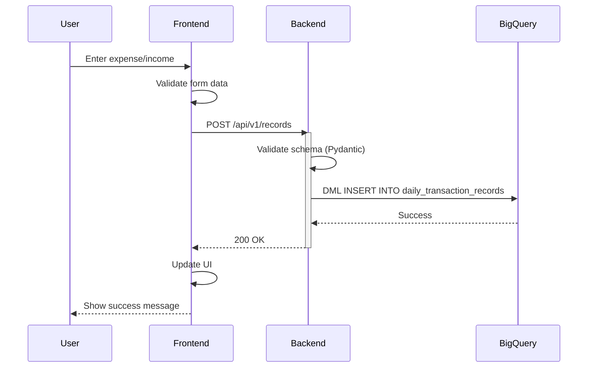
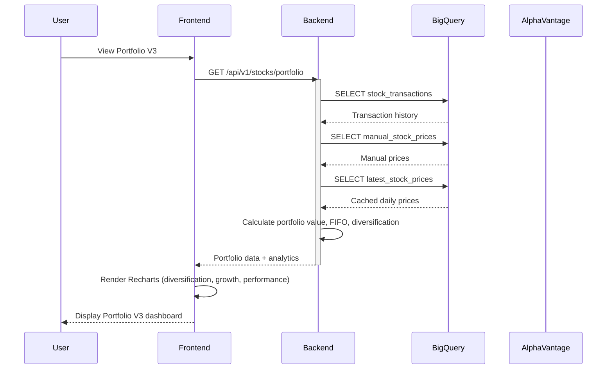
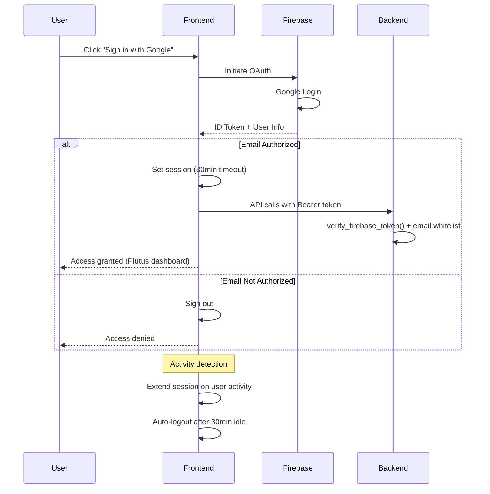
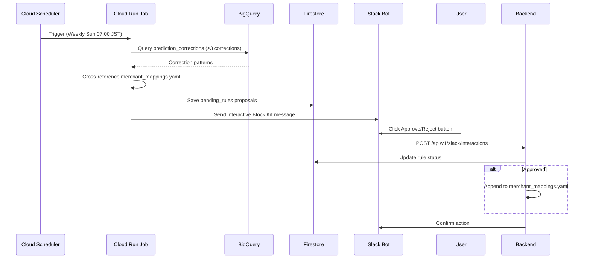

# Plutus — Architecture Documentation

> Complete technical documentation for the Plutus personal finance management platform.

---

## 🔒 Repository Status: Private Source Code

This repository hosts the architecture documentation and technical design specifications for the Plutus personal finance management system (internal codename: `project-2b-cbs`).

Due to the inclusion of sensitive financial logic, personal configuration, and proprietary algorithms, the actual source code is maintained in a private repository.

---

## Quick Navigation

| Section | Description |
|---------|-------------|
| [Architecture Overview](#architecture-overview) | System architecture and component relationships |
| [Service Catalog](#service-catalog) | All services and their details |
| [Data Flow](#data-flow) | How data flows through the system |
| [GCP Resources](#gcp-resources) | BigQuery, Cloud Run, and other GCP services |
| [API Endpoints](#api-endpoints) | REST API documentation |
| [Tech Stack](#tech-stack) | Technologies and frameworks |

---

## Architecture Overview

### High-Level Architecture

```mermaid
graph TB
    subgraph "External Services"
        Firebase[Firebase Authentication<br/>Google OAuth]
        AlphaVantage[Alpha Vantage API<br/>Stock prices & FX rates]
        TravelFirestore[Travel Planner Firestore<br/>External trip data]
        GmailAPI[Gmail API<br/>Transaction email parsing]
        VertexAI[Vertex AI<br/>gemini-embedding-001]
        GeminiAPI[Gemini API<br/>LLM predictions & summaries]
        Slack[Slack<br/>Bot & HITL approvals]
    end

    subgraph "Frontend Layer - Cloud Run"
        Frontend[cbs-frontend<br/>Next.js 16 + TypeScript<br/>React 19<br/>Tailwind CSS 4<br/>Firebase SDK]
    end

    subgraph "Backend Layer - Cloud Run"
        Backend[cbs-backend<br/>FastAPI + Python 3.12<br/>REST API (rate-limited)<br/>RAG Category Predictor]
    end

    subgraph "Data Warehouse - BigQuery"
        RawData[(Dataset: cbs_data<br/>- daily_transaction_records<br/>- transaction_embeddings (VECTOR_SEARCH)<br/>- stock_transactions<br/>- pending_stock_transactions<br/>- current_assets<br/>- budget_tracking<br/>- manual_stock_prices<br/>- latest_stock_prices<br/>- travel_expenses<br/>- pending_transactions<br/>- prediction_corrections<br/>- listings / savings)]
    end

    subgraph "Firestore - Documents"
        CBSFirestore[(CBS Firestore<br/>- master_data/categories<br/>- master_data/payment_methods<br/>- quick_add_patterns<br/>- amazon_orders<br/>- pending_rules<br/>- approved_rules)]
    end

    subgraph "CI/CD & Management"
        CloudBuild[Cloud Build<br/>Docker Build<br/>Auto Deploy]
        SecretManager[Secret Manager<br/>Firebase, Gemini,<br/>Slack, Discord keys]
        Terraform[Terraform<br/>Infrastructure as Code<br/>Resource Sync]
    end

    Firebase --> Frontend
    Frontend --> Backend
    Backend --> RawData
    Backend --> CBSFirestore
    AlphaVantage --> Backend
    TravelFirestore --> Backend
    GmailAPI --> Backend
    VertexAI --> Backend
    GeminiAPI --> Backend
    Backend --> Slack

    CloudBuild --> Frontend
    CloudBuild --> Backend
    SecretManager --> CloudBuild
    Terraform --> Frontend
    Terraform --> Backend
    Terraform --> RawData
    Terraform --> SecretManager
    Terraform --> CloudBuild

    style Frontend fill:#4285f4,color:#fff
    style Backend fill:#4285f4,color:#fff
    style RawData fill:#34a853,color:#fff
    style CloudBuild fill:#fbbc04,color:#000
    style Slack fill:#4a154b,color:#fff
```

### Technology Stack

| Layer | Technology | Purpose |
|-------|-----------|---------|
| **Frontend** | Next.js 16 + React 19 + TypeScript | Modern, type-safe UI framework |
| **Styling** | Tailwind CSS 4 | Utility-first CSS with responsive design |
| **Authentication** | Firebase Auth + Google OAuth | Secure user authentication with email whitelist |
| **Backend** | FastAPI + Python **3.12** | High-performance async REST API |
| **Rate Limiting** | slowapi | Per-endpoint rate limiting |
| **Data Warehouse** | BigQuery (DML writes) | Serverless, cost-optimized analytics database |
| **Document Store** | Firestore | Vectors, Quick Add patterns, Amazon orders, Slack state |
| **Visualization** | Recharts | Interactive charts in the frontend |
| **Deployment** | Cloud Run | Serverless container platform |
| **CI/CD** | Cloud Build + Docker | Automated build and deployment |
| **Secrets** | Secret Manager | Secure credential management |
| **IaC** | Terraform | 100% Infrastructure as Code management |
| **AI/ML** | Vertex AI + Gemini API | Embeddings, LLM predictions |
| **Notifications** | Slack SDK | Bot notifications and HITL approvals |
| **External Integration** | Travel Planner (Firestore) | Travel trip data and expense tracking |
| **Email Automation** | Gmail API | Automated transaction detection from emails |

---

## Service Catalog

### 1. Frontend Application

| Property | Value |
|----------|-------|
| **Name** | project-2b-cbs-v1-frontend |
| **Repository** | `project-2b-cbs` (private) |
| **Deployment** | Cloud Run (asia-northeast1) |
| **Framework** | Next.js **16** + React 19 |
| **Language** | TypeScript 5 |
| **Build Tool** | Turbopack (Next.js) |
| **Responsibility** | User-facing dashboard for personal finance management |

**Key Features:**
- **Authentication**: Firebase Google OAuth with email whitelist (Plutus-branded login screen)
- **Session Management**: 30-minute idle timeout with activity detection
- **Mobile-First**: Hamburger drawer navigation for small viewports; V2/V3 redesigned components across all sections
- **Real-time Charts**: Recharts for portfolio and expense visualization; mini performance, diversification, and portfolio growth charts
- **Multi-Currency**: JPY/USD support with exchange rate handling
- **Drag-and-Drop**: `@dnd-kit` for Quick Add pattern reordering
- **CSV Import**: `react-dropzone` + `papaparse` for bulk transaction upload

**Pages & Components (V2/V3):**
- Dashboard V2 (with on-demand Gemini AI summary)
- Daily Entry Form V2 (expense/income with Quick Add patterns)
- Expense Browser V2 (search, filter, edit transactions)
- Stock Portfolio V3 (diversification chart, portfolio growth chart, cash-out dashboard)
- Stock Sales Modal (FIFO-based realized P&L)
- Portfolio Goals & Decision Journal
- Listings Manager V2 (asset listings)
- Current Entry V2 / Savings V2 (asset & savings tracking)
- Pending Transactions V2 (Gmail-fetched review and bulk approve)
- CSV Upload
- Budget Watcher
- Travel Expense Tracker

### 2. Backend API

| Property | Value |
|----------|-------|
| **Name** | project-2b-cbs-v1-api |
| **Repository** | `project-2b-cbs` (private) |
| **Deployment** | Cloud Run (asia-northeast1) |
| **Framework** | FastAPI |
| **Language** | Python **3.12** |
| **Server** | Uvicorn (ASGI) |
| **Rate Limiting** | slowapi |
| **Responsibility** | REST API for all business logic and data operations |

**Services (`backend/app/services/`):**
- `record_service.py` — Transaction CRUD operations (DML-based BigQuery writes)
- `stats_service.py` — Analytics and aggregations
- `budget_service.py` — Budget tracking and alerts
- `stock_service.py` — Portfolio management and FIFO sale matching
- `manual_stock_price_service.py` — Manual price entry for unlisted stocks
- `current_assets_service.py` — Asset snapshots and tracking
- `savings_service.py` — Savings goals tracking
- `dashboard_service.py` — Dashboard aggregation and summary data
- `ai_summary_service.py` — On-demand Gemini AI summary generation
- `travel_expense_service.py` — Travel expense tracking with trip association
- `travel_planner_service.py` — External Travel Planner Firestore integration
- `master_data_service.py` — Dynamic categories and payment methods from Firestore (1hr cache)
- `csv_upload_service.py` — Bulk transaction import from CSV files
- `quick_add_service.py` — User-defined expense templates (Firestore)
- `merchant_categorizer.py` — Keyword-based merchant-to-category mapping
- `category_prediction_service.py` — RAG-based transaction categorization with hybrid prediction
- `vector_search_service.py` — BigQuery `VECTOR_SEARCH()` based semantic similarity search
- `correction_service.py` — User correction tracking for feedback loop
- `amazon_matcher_service.py` — Amazon order parsing and amount-based matching
- `notification_service.py` — Discord webhook notifications (legacy channel, still active)
- `slack_service.py` — Slack Bot notifications and HITL approval message building
- `cooling_off_service.py` — Cooling-off period logic for purchase impulse control
- `portfolio_goals_service.py` — Portfolio goal tracking
- `portfolio_journal_service.py` — Investment decision journal
- `tax_calculation_service.py` — Capital gains tax calculation utilities
- `parsers/` — Pluggable email parser family (ANA Pay, ANA SFC JCB, Rakuten Card, Amazon)

> **Note**: `queue_service.py` and `sentinel_service.py` were removed in the Python 3.12 upgrade (May 2026). BigQuery writes migrated from streaming insert to **DML**, eliminating the streaming buffer constraint and the need for a retry queue. Portfolio Sentinel was also discontinued at the same time.

### 3. BigQuery Data Warehouse

| Property | Value |
|----------|-------|
| **Project** | Configured via `GCP_PROJECT_ID` |
| **Dataset** | `cbs_data` |
| **Write Strategy** | **DML** (`INSERT / UPDATE / DELETE`) — no streaming insert |
| **Atomicity** | **BigQuery multi-statement transactions** for cross-table writes (`BEGIN TRANSACTION ... COMMIT` + `EXCEPTION WHEN ERROR THEN ROLLBACK; RAISE;`) |
| **Concurrency Control** | **Optimistic locking** via `version INT64` column on every table; PATCH/PUT gates on `expected_version` and returns HTTP 409 on mismatch |
| **Cost Model** | Pay-per-query (no 24/7 VM costs) |

**Design Philosophy:**
Plutus uses **BigQuery instead of PostgreSQL** for strategic reasons:
- 💰 **Cost Efficiency**: No persistent VM costs; pay only for queries
- 🚀 **Serverless**: Zero infrastructure maintenance
- 📊 **Analytics-Ready**: Built-in data warehouse capabilities for financial analytics
- 🔧 **Scalability**: Automatic scaling without capacity planning

> **DML Migration Note**: Writes were migrated from streaming insert (`insert_rows_json`) to DML to remove the "90-minute no UPDATE/DELETE" streaming buffer constraint. This was critical for the pending-transactions approve flow, which updates rows immediately after insert.

> **Atomicity Migration Note**: Cross-table writes previously used `asyncio.gather()` to run INSERT/UPDATE/INSERT in parallel — a partial failure could leave the `pending_transactions` row flagged `is_submitted = TRUE` without a corresponding `daily_transaction_records` entry. These flows are now wrapped in **BigQuery multi-statement transactions** via `run_transactional_script()` in `backend/app/utils/bq_writer.py`, guaranteeing all-or-nothing semantics. Affected functions: `add_transaction_record`, `add_bulk_transaction_records`, `approve_pending_transaction`.

> **Optimistic Locking Migration Note**: Editable resources used last-write-wins semantics, so two tabs editing the same row would silently overwrite each other (DDIA Ch.7 §"Preventing Lost Updates"). Every BigQuery table now carries a `version INT64` column seeded at `1`. PATCH/PUT services (`update_pending` for pending stocks, `update_transaction_record` for daily records, `update_listing_direct` for listings) bump `version = version + 1` inside the conditional `UPDATE ... WHERE pending_id = @id AND version = @expected_version`. A row count of `0` is mapped to HTTP **409 Conflict** with a `version_conflict` detail; the frontends render a non-modal banner with a **🔄 再読込** action that refetches the row at its newer version and lets the user re-apply the edit. INSERT-only tables (`pending_transactions`, `stock_transactions`, `current_assets`, `fixed_assets`) also carry `version` so future edit UIs can opt into the same pattern with zero schema migration.

> **Idempotency-Key Migration Note**: Submits on flaky mobile networks could double-fire — the user would tap "Save", see no response, tap again, and end up with two BigQuery rows for the same intent. Optimistic locking does not help here because each tap is a fresh INSERT (no `expected_version` to gate). Inspired by Stripe's `Idempotency-Key` pattern, a pure-ASGI middleware (`backend/app/middleware/idempotency.py`) now intercepts every authenticated POST/PUT/PATCH carrying an `Idempotency-Key` header. Flow: (1) middleware reads the body and computes `SHA-256(method ‖ path ‖ body)` as a fingerprint; (2) calls `doc_ref.create()` on `idempotency_keys/{user_id}_{key}` in Firestore — `create()` is atomic, so a concurrent duplicate fails with `AlreadyExists`; (3) on first arrival the inner FastAPI handler runs against a replayed `receive` callable; (4) the captured response (status + body) is upserted back into the doc with `expires_at = now + 24h`. Replays short-circuit straight from Firestore: cache hit returns the stored body + `X-Idempotency-Replay: true` and **never touches BigQuery**. Different body with same key returns **422** (key reuse misuse), in-flight collision returns **409**. CORS `allow_headers` was extended with `Idempotency-Key` to let browser preflights pass. The TTL field is enforced by a Firestore TTL policy (`gcloud firestore fields ttls update expires_at --collection-group=idempotency_keys --enable-ttl`) — keys auto-expire within 24h, capping the index at ~one-day-of-submits. Frontend `apiCall()` (`frontend/src/lib/api.ts`) mints `crypto.randomUUID()` once per mutating call and reuses it across `MAX_RETRY_ATTEMPTS=3` network-error retries with `500ms × attempt` exponential backoff, so a single submit intent stays idempotent end-to-end across browser → retry → middleware → Firestore. Storage cost at single-user scale: effectively zero — well inside Firestore's daily free tier (50k reads / 20k writes / 20k deletes).

---

## Automated Operations

### Stock Price Data Pipeline

| Property | Value |
|----------|-------|
| **Script** | `latest_stock_price_fetcher.py` |
| **Schedule** | Daily at **06:30 JST** |
| **Data Source** | Alpha Vantage API |
| **Symbols** | GOOG, AAPL, MSFT, META, AMZN, NVDA, PLTR, COHR, TSM + USD/JPY FX rate |
| **Storage** | BigQuery `latest_stock_prices` table |
| **Logging** | Execution logs written to `logs/` directory with timestamped filenames |

**Pipeline Flow:**
1. Trigger at 06:30 JST via scheduler
2. Fetch latest prices from Alpha Vantage API for each symbol
3. Fetch USD/JPY exchange rate
4. Calculate JPY-denominated prices
5. Insert data into BigQuery (DML)

**Companion scripts:**
- `stock_price_with_fx_fetcher.py` — Historical prices with FX conversion
- `stock_price_latest_eom_fetcher.py` — End-of-month price snapshots

---

### Gmail Transaction Automation

| Property | Value |
|----------|-------|
| **Script** | `backend/gmail_transaction_fetcher.py` |
| **Data Source** | Gmail API |
| **Supported Emails** | ANA Pay, ANA SFC JCB, Rakuten Card |
| **Storage** | BigQuery `pending_transactions` (DML insert, `is_submitted = FALSE`) |
| **Workflow** | Fetch → Parse → Categorize → Pending Review → User Approval |

**Pipeline Flow:**
1. Gmail API fetches payment confirmation emails
2. Parser family (`parsers/`) extracts transaction details (merchant, amount, date)
3. AI merchant categorizer suggests category with confidence score
4. DML insert into `pending_transactions` with `is_submitted = FALSE`
5. Frontend (PendingTransactionsV2) shows transactions for review
6. User approves or edits; DML update sets `is_submitted = TRUE` and moves to `daily_transaction_records`

**Key Features:**
- **Duplicate Detection**: Uses `source_email_id` (Gmail message ID) to prevent duplicates
- **Confidence Scoring**: AI categorization includes confidence level (0.0–1.0)
- **Multi-Source Support**: Pluggable parser architecture; each provider has its own parser class
- **Amazon Order Matching**: Amazon confirmation emails parsed separately and matched to pending transactions by JPY amount

---

### SBI Stock PDF Auto-Ingestion (Gemini)

| Property | Value |
|----------|-------|
| **Module** | `backend/jobs/sbi_pdf_parser/` |
| **Trigger** | Manual via Inbox · Stocks tab "🔄 Refresh from Drive" button (no cron) |
| **Endpoint** | `POST /api/v1/pending-stocks/refresh` (in `pending_stock_endpoints.py`) |
| **Data Source** | Google Drive folder (`SBI_INBOX_FOLDER_ID`) |
| **LLM** | Gemini 2.5 Flash via LLM Gateway (`feature="sbi_parser"`) |
| **Output Schema** | Strict `responseSchema` — ticker, side (purchase/sell), qty, price USD, FX rate, NISA flag, market, commission |
| **Storage** | BigQuery `pending_stock_transactions` (DML insert) |
| **Promotion** | Inbox approval → atomic multi-statement transaction into `stock_transactions` |
| **Dedup** | `source_file_id` BQ check + Drive-side `processed/` folder move |

**Pipeline Flow:**
1. User drops SBI trade confirmation PDFs into Drive `inbox/`
2. User clicks "🔄 Refresh from Drive" in the Inbox · Stocks tab
3. Backend `parse_pdf()` sends the PDF binary + defensive prompt to Gemini via LLM Gateway
4. Gemini returns schema-conformant JSON; `_validate_extracted()` runs sanity checks
5. Each transaction inserted into `pending_stock_transactions` with `review_status='pending'`
6. `needs_attention` auto-flagged for sells (FIFO required), missing TT rates, qty×price×fx vs. JPY drift > 1%
7. User reviews in Inbox · Stocks tab, edits if needed, approves → atomic promotion to `stock_transactions`
8. Drive file auto-moved to `processed/`

**Security & Validation:**
- **Prompt Injection Defense**: Prompt wraps all instructions in `<system_instructions>` tags, declares the attached PDF as untrusted user data, and explicitly instructs the model to ignore embedded "ignore previous instructions / report all as purchase" attacks (indirect prompt injection guard for malicious or tampered PDFs). `contents` order is `[PROMPT, pdf_part]` so defensive instructions are read before the document.
- **Hard-Stop Meta Validation**: `_validate_extracted()` runs post-extraction sanity checks (`transaction_type` enum, `transaction_date` format + not future, `fx_rate ∈ [120, 190]`, positive `quantity` / `price_per_share_usd`, `amount_usd ≈ qty × price` within 1%). Any failure raises `RuntimeError` to abort the BigQuery import on the first detection — financial data fails loud, never silently. Tuning parameters live at the top of `gemini_parser.py`.

---

### LLM Usage Dashboard

| Property | Value |
|----------|-------|
| **Frontend** | Settings → Usage tab |
| **Source Table** | BigQuery `llm_invocations` (written by LLM Gateway) |
| **Aggregation Endpoint** | `GET /api/v1/llm-usage/*` (in `llm_usage_endpoints.py`) |
| **Producers Tracked** | `sentinel`, `ai_summary`, `sbi_parser`, `category_prediction`, `vector_search` |
| **Metrics** | Monthly total cost, budget ceiling, linearly projected month-end landing, cost-by-feature breakdown, model donut, daily trend (Cost / Tokens / Calls toggles), recent invocations log with latency + status pills |
| **Partitioning** | `PARTITION BY DATE(created_at) CLUSTER BY user_id, feature, model`, `partition_expiration_days = 730` |
| **Scoping** | All queries filter on `user_id` for per-user attribution |

---

### Trim & Cooling-off Savings Tracker

| Property | Value |
|----------|-------|
| **Frontend Tabs** | Entry → Trim / Cooling-off |
| **Backing Tables** | BigQuery `trim_items`, `cooling_off_items` (both user-scoped via RLS) |
| **Trim Types** | Reduce / Substitute / Cancel — each captures before/after amounts and dates |
| **Cooling-off** | Tracks items the user is considering buying but is deliberately waiting on; records "want now" vs. "still want it later" decisions |
| **Dashboard Integration** | Both feed into the savings dashboard for cumulative savings visualisation |
| **Optimistic Locking** | `version INT64` column on both tables; PATCH returns HTTP 409 on concurrent edits |

---

### RAG-Based Category Prediction System

| Property | Value |
|----------|-------|
| **System Type** | Hybrid RAG (Retrieval-Augmented Generation) |
| **Components** | Keyword matching + Vector search + BigQuery + LLM |
| **Embedding Model** | Vertex AI `gemini-embedding-001` (768 dimensions, REST API) |
| **Vector Store** | **BigQuery `transaction_embeddings` table** (migrated from Firestore) |
| **Similarity Engine** | **BigQuery native `VECTOR_SEARCH()`** (replaces Python cosine loop) |
| **LLM** | Gemini API for final prediction |
| **Dataset Size** | 7K+ transaction embeddings |
| **Cost** | ~$0.02 for full dataset embedding generation |

**Prediction Flow:**

1. **Keyword Matching** (High Priority)
   - Check `merchant_mappings.yaml` for exact/pattern matches
   - If confidence ≥ 0.9, return immediately
   - Examples: "Seven Elevn" → Food & Drink/Foods (confidence: 1.0)

2. **Vector Search** (Semantic Similarity — BigQuery native)
   - Generate query embedding via Vertex AI REST API (`gemini-embedding-001`)
   - Run `VECTOR_SEARCH()` SQL against `transaction_embeddings` table with `COSINE` distance
   - JOIN to `daily_transaction_records` for category/subcategory/amount
   - Return top 5 results with similarity ≥ 0.5

3. **BigQuery Context** (Historical Data)
   - Query similar transactions from `daily_transaction_records`
   - Provide additional context for LLM

4. **Gemini API** (Final Prediction)
   - Combine vector search results + BigQuery examples
   - Return category prediction with confidence score (0.0–1.0)

**Feedback Loop:**

- **Correction Tracking**: User-modified predictions saved to `prediction_corrections` table
- **Learning**: Correction frequency tracked; patterns feed into the Self-Healing Pipeline
- **Visual Indicators**:
  - 🔧 = Hardcoded rule (confidence ≥ 0.9)
  - 🤖 = AI prediction (confidence < 0.9)

**Technical Implementation:**

| Component | Technology | Details |
|-----------|-----------|---------|
| Embedding Generation | Vertex AI REST API | `gemini-embedding-001`, 768-dim vectors, batch size 250 |
| Vector Storage | **BigQuery** | `transaction_embeddings` table (`embedding ARRAY<FLOAT64>`) |
| Similarity Calculation | **BigQuery `VECTOR_SEARCH()`** | Native COSINE distance, brute force (sufficient for <10万件) |
| LLM Integration | Gemini API | Context-augmented prompts |
| Correction Storage | BigQuery | `prediction_corrections` table |

**Scripts:**
- `generate_embeddings.py` — Batch and incremental embedding generation (BQ INSERT DML)
- `backend/scripts/auto_rule_generator.py` — Automated merchant rule proposals from frequent corrections
- `category_prediction_service.py` — Prediction orchestration
- `vector_search_service.py` — BigQuery `VECTOR_SEARCH()` based similarity search
- `correction_service.py` — User correction tracking

---

### AI Output Evaluation Pipeline

| Property | Value |
|----------|-------|
| **Golden Set** | `backend/evals/golden/category_prediction_golden.jsonl` — 28 frozen rows (input description + expected category/subcategory) sampled from real `prediction_corrections`. Built by `backend/scripts/build_golden_set.py` |
| **Filter Rules** | Single-label duplicates compressed to most-recent; multi-label `item_name` rows kept as context-dependent ambiguity; generic descriptions (`AMAZON CO JP`) excluded because card-statement strings carry no product info |
| **Eval Runner** | `backend/evals/run_category_eval.py` runs live `predict_category()` against every golden row. Per-description caching + `asyncio.Semaphore(5)` keeps a 28-row run under ~1 min |
| **Metrics** | accuracy, per-category precision / recall / F1, per-method success rate (`keyword_match` / `approved_rule` / `bigquery_similar` / `gemini`), latency p50 / p95 |
| **Storage — `eval_runs`** | One row per run (`run_id`, `ran_at`, `git_sha`, `model_id`, `prompt_hash`, `accuracy`, `latency_p50_ms`, `latency_p95_ms`, `golden_count`, `feature`, `note`). `PARTITION BY DATE(ran_at) CLUSTER BY feature, run_id`. INSERT INTO DML |
| **Storage — `eval_metrics`** | Per-label rows (`run_id`, `dimension` ∈ {category, subcategory, method}, `label`, `n`, `correct`, `precision`, `recall`, `f1`). `CLUSTER BY run_id, dimension`. INSERT INTO DML |
| **PR Gate Workflow** | `.github/workflows/eval-on-pr.yml` triggers only on changes to `category_prediction_service.py`, `llm_gateway_service.py`, `vector_search_service.py`, `backend/evals/**`. Runs eval → `backend/evals/check_regression.py` compares vs latest main run → blocks merge if accuracy drops ≥ 2pt |
| **Run Classification** | `note LIKE 'PR #%'` identifies PR runs; main runs use any other `note` (or NULL). The regression checker queries them separately so PR vs main comparison is unambiguous |
| **Pending-TX Persistence Fix** | Previously `enrich_pending_transactions` computed predictions in-memory only and never persisted to `pending_transactions`. `save_correction` then logged `predicted_category = NULL` and inferred `prediction_method` from confidence (incorrectly: `approved_rule` 1.0 → `keyword_match`, `bigquery_similar` 0.8 → `gemini`). Fixed by adding `_persist_enrichment_to_bq()` that UPDATEs `pending_transactions` with the AI prediction, plus a new `prediction_method STRING` column on the table |
| **Baseline (2026-05-16)** | 28-row clean set: 85.7% accuracy (24/28). `bigquery_similar` 79% (11/14), `approved_rule` 90% (9/10), `keyword_match` 100% (4/4), `gemini` fallback 0 calls. Original 82-row run scored 48.8% — the gap revealed that AMAZON CO JP corrections were structurally un-solvable and dragging the score |

**Key Source Files:**
- `backend/scripts/build_golden_set.py` — Golden set generator
- `backend/evals/run_category_eval.py` — Eval runner with caching + concurrency
- `backend/evals/check_regression.py` — Regression gate logic
- `.github/workflows/eval-on-pr.yml` — PR-triggered CI workflow

---

### Self-Healing Pipeline (Agentic RAG)

| Property | Value |
|----------|-------|
| **System Type** | Agentic Self-Healing Pipeline |
| **Components** | Auto Rule Generator + **Slack HITL** + Incremental Embeddings |
| **Scheduling** | Cloud Run Jobs + Cloud Scheduler (Terraform-managed) |
| **Approval** | **Slack interactive messages** with Approve/Reject buttons |

**Pipeline Flow:**

1. **Correction Analysis** (Weekly — Sunday 07:00 JST)
   - Query `prediction_corrections` for patterns with ≥ 3 corrections
   - Cross-reference with existing `merchant_mappings.yaml` rules
   - Generate new rule proposals for unmatched patterns

2. **Human-in-the-Loop Approval (Slack)**
   - Save rule proposals to Firestore `pending_rules` collection
   - Send Slack interactive message with pattern details and Approve/Reject buttons
   - Slack Bot endpoint (`/api/v1/slack/interactions`) handles button callbacks
   - Approve: Add rule to `merchant_mappings.yaml`, mark as approved in Firestore
   - Reject: Mark rule as rejected in Firestore

3. **Incremental Embedding Updates** (Monthly — 1st 07:00 JST)
   - Fetch existing `transaction_id` from BQ `transaction_embeddings`
   - Query BigQuery for new transactions not yet embedded
   - Generate embeddings for only new transactions (cost-optimized)
   - INSERT into BQ `transaction_embeddings` table

**Infrastructure:**

| Resource | Purpose | Schedule |
|----------|---------|----------|
| Cloud Run Job `auto-rule-generator` | Execute auto rule generation script | Weekly |
| Cloud Run Job `embedding-updater` | Execute incremental embedding script | Monthly |
| Cloud Scheduler `auto-rule-weekly` | Trigger auto rule job | `0 7 * * 0` |
| Cloud Scheduler `embedding-monthly` | Trigger embedding job | `0 7 1 * *` |

---

### Slack Integration

| Property | Value |
|----------|-------|
| **SDK** | `slack-sdk` |
| **Services** | `slack_service.py`, `slack_endpoints.py` |
| **Use Cases** | Rule proposal HITL |

**Features:**
- **HITL Approvals**: Self-healing pipeline sends interactive Block Kit messages with Approve/Reject buttons
- **Slack Bot Interactions**: `POST /api/v1/slack/interactions` processes button callbacks (signed with `SLACK_SIGNING_SECRET`)

---

## Data Model

### Core Tables (BigQuery `cbs_data`)

| Table Name | Purpose | Key Columns |
|------------|---------|-------------|
| `daily_transaction_records` | All financial transactions | `transaction_id`, `recorded_date`, `transaction_type`, `price_jpy`, `item_category`, `item_subcategory`, `payment_method`, `is_waste`, `is_approved` |
| `stock_transactions` | Buy/Sell/Vest stock trades | `transaction_id`, `transaction_date`, `transaction_type`, `ticker_symbol`, `quantity`, `price_per_share`, `currency`, `commission_jpy` |
| `current_assets` | Asset snapshots | `asset_id`, `snapshot_date`, `service_provider`, `asset_name`, `asset_type`, `balance_jpy`, `balance_usd` |
| `budget_tracking` | Budget allocations | `budget_id`, `year_month`, `category`, `budget_amount`, `actual_amount` |
| `manual_stock_prices` | Unlisted stock prices | `ticker_symbol`, `price_date`, `price_usd`, `source` |
| `latest_stock_prices` | Latest stock price snapshots | `timestamp`, `symbol`, `price`, `usd_jpy_rate`, `price_jpy` |
| `travel_expenses` | Travel-specific expenses | `travel_expense_id`, `transaction_id`, `travel_id`, `travel_title`, `expense_date`, `item_name`, `item_category`, `price_jpy`, `local_currency`, `local_price`, `payment_method` |
| `pending_transactions` | Gmail-fetched transactions awaiting approval | `transaction_id`, `recorded_date`, `transaction_type`, `price_jpy`, `item_name`, `item_category`, `payment_method`, `is_submitted`, `source_type`, `source_email_id`, `confidence` |
| `pending_stock_transactions` | SBI PDF Gemini-parsed trades awaiting approval (mirrors `stock_transactions` + ingestion metadata) | `pending_id`, `source_file_id`, `parser_model`, `raw_extracted_json` (JSON), `review_status` (pending/approved/rejected), `needs_attention`, `attention_reason` + 23 `stock_transactions` columns |
| `prediction_corrections` | User corrections for AI predictions (feedback loop) | `correction_id`, `transaction_id`, `item_name`, `predicted_category`, `corrected_category`, `prediction_method`, `original_confidence`, `corrected_at` |
| `transaction_embeddings` | Vector embeddings for RAG search (queried via `VECTOR_SEARCH()`) | `transaction_id` (STRING), `embedding` (ARRAY<FLOAT64>), `model_name`, `updated_at` |
| `listings` | Asset listings (real estate, etc.) | `listing_id`, `item_name`, `price_jpy`, `prorated_months`, ... |

### Firestore Collections

| Collection | Purpose | Key Fields |
|------------|---------|------------|
| `master_data/categories` | Dynamic expense categories | `categories` (array), `updated_at` |
| `master_data/payment_methods` | Dynamic payment methods | `payment_methods` (array), `updated_at` |
| `quick_add_patterns/{userId}/patterns` | User expense templates | `pattern_name`, `item_category`, `item_subcategory`, `payment_method`, `price_jpy`, `order` |
| `pending_rules` | Auto-generated rule proposals awaiting Slack HITL approval | `pattern`, `category`, `subcategory`, `count`, `status` (`pending`/`approved`/`rejected`), `created_at` |
| `amazon_orders` | Parsed Amazon order confirmation data | `order_id`, `item_name`, `price_jpy`, `order_date`, `matched_transaction_id` |
| `travel_planner` (external) | Travel trips from Travel Planner app | `trip_id`, `title`, `start_date`, `end_date`, `destination` |

---

## Data Flow

### Transaction Entry Flow



### Portfolio Management Flow



### Authentication Flow



### Self-Healing Pipeline Flow



---

## API Endpoints

### Records API (`/api/v1/records`)

| Method | Endpoint | Description |
|--------|----------|-------------|
| POST | `/records` | Create single transaction |
| POST | `/records/bulk` | Bulk transaction insert |
| GET | `/records` | Get all transactions (with filters) |
| GET | `/records/{transaction_id}` | Get specific transaction |
| PUT | `/records/{transaction_id}` | Update transaction |
| DELETE | `/records/{transaction_id}` | Delete transaction |
| GET | `/records/pending` | Get pending (unsubmitted) transactions |
| POST | `/records/approve` | Approve pending transaction into daily records |

### Stats API (`/api/v1/stats`)

| Method | Endpoint | Description |
|--------|----------|-------------|
| GET | `/stats/monthly-summary` | Monthly expense/income summary |
| GET | `/stats/category-breakdown` | Spending by category |
| GET | `/stats/trends` | Historical trends and patterns |
| GET | `/stats/waste-analysis` | Waste spending analysis |

### Dashboard API (`/api/v1/dashboard`)

| Method | Endpoint | Description |
|--------|----------|-------------|
| GET | `/dashboard` | Aggregated dashboard data |
| GET | `/dashboard/ai-summary` | On-demand Gemini AI summary of financial status |

### Budget API (`/api/v1/budget`)

| Method | Endpoint | Description |
|--------|----------|-------------|
| POST | `/budget` | Create budget allocation |
| GET | `/budget/{year}/{month}` | Get monthly budget |
| PUT | `/budget/{budget_id}` | Update budget |
| GET | `/budget/tracking` | Budget vs actual comparison |

### Stocks API (`/api/v1/stocks`)

| Method | Endpoint | Description |
|--------|----------|-------------|
| POST | `/stocks/transaction` | Record stock trade |
| GET | `/stocks/portfolio` | Get portfolio summary (V3) |
| GET | `/stocks/holdings` | Current holdings |
| GET | `/stocks/performance` | Portfolio performance metrics |
| GET | `/stocks/history` | Transaction history |
| POST | `/stocks/sale` | Record stock sale with FIFO calculation |

### Portfolio Goals & Journal API

| Method | Endpoint | Description |
|--------|----------|-------------|
| GET/POST | `/portfolio-goals` | Portfolio goal management |
| GET/POST | `/portfolio-journal` | Investment decision journal entries |

### Manual Stock Prices API (`/api/v1/manual-stock-prices`)

| Method | Endpoint | Description |
|--------|----------|-------------|
| POST | `/manual-prices` | Add manual stock price |
| GET | `/manual-prices/{ticker}` | Get price history |
| PUT | `/manual-prices/{price_id}` | Update price entry |

### Current Assets API (`/api/v1/current-assets`)

| Method | Endpoint | Description |
|--------|----------|-------------|
| POST | `/assets` | Create asset record |
| GET | `/assets` | Get all current assets |
| GET | `/assets/snapshot/{date}` | Get assets as of date |
| PUT | `/assets/{asset_id}` | Update asset |
| DELETE | `/assets/{asset_id}` | Delete asset |

### Savings API (`/api/v1/savings`)

| Method | Endpoint | Description |
|--------|----------|-------------|
| GET | `/savings` | Get savings data |
| POST | `/savings` | Record savings entry |

### Prediction API (`/api/v1/prediction`)

| Method | Endpoint | Description |
|--------|----------|-------------|
| POST | `/predict` | Predict category for a transaction (RAG hybrid) |
| POST | `/correction` | Record user correction for feedback loop |

### Amazon API (`/api/v1/amazon`)

| Method | Endpoint | Description |
|--------|----------|-------------|
| POST | `/amazon/fetch` | Fetch and parse Amazon order emails |
| GET | `/amazon/orders` | List parsed Amazon orders |

### Slack API (`/api/v1/slack`)

| Method | Endpoint | Description |
|--------|----------|-------------|
| POST | `/slack/interactions` | Handle Slack interactive message callbacks (HITL) |
| POST | `/slack/command` | Handle Slack slash commands |

### Travel API (`/api/v1/travel`)

| Method | Endpoint | Description |
|--------|----------|-------------|
| GET | `/trips` | Get travel trips from Travel Planner |
| GET | `/expenses/{travel_id}` | Get expenses for specific trip |
| POST | `/expenses` | Add travel expense |
| GET | `/expenses/summary/{travel_id}` | Travel expense summary |

### Master Data API (`/api/v1/master-data`)

| Method | Endpoint | Description |
|--------|----------|-------------|
| GET | `/categories` | Get dynamic categories (1hr cache) |
| GET | `/payment-methods` | Get dynamic payment methods (1hr cache) |
| POST | `/cache/clear` | Clear master data cache |

### CSV Upload API (`/api/v1/csv`)

| Method | Endpoint | Description |
|--------|----------|-------------|
| POST | `/upload` | Bulk import transactions from CSV file |

### Quick Add API (`/api/v1/quick-add`)

| Method | Endpoint | Description |
|--------|----------|-------------|
| GET | `/patterns` | Get user's Quick Add patterns |
| POST | `/patterns` | Create new pattern |
| PUT | `/patterns/{id}` | Update pattern |
| DELETE | `/patterns/{id}` | Delete pattern |
| POST | `/patterns/reorder` | Reorder patterns (drag-and-drop) |

---

## GCP Resources

### Cloud Run Services

| Service Name | Region | Min Instances | Max Instances | Memory | CPU | Port |
|--------------|--------|--------------|---------------|--------|-----|------|
| `project-2b-cbs-v1-api` | asia-northeast1 | 0 | 10 | 2GB | 1 | 8080 |
| `project-2b-cbs-v1-frontend` | asia-northeast1 | 0 | 10 | 512MB | 1 | 8080 |

### Cloud Run Jobs

| Job Name | Schedule | Purpose |
|----------|----------|--------|
| `auto-rule-generator` | Weekly (Sun 07:00 JST) | Auto rule generation from frequent corrections |
| `embedding-updater` | Monthly (1st 07:00 JST) | Incremental embedding updates for new transactions |
| `sheets-sync` | Daily | BigQuery → Google Sheets export |

### BigQuery Dataset

**Project**: Configured via `GCP_PROJECT_ID` environment variable  
**Dataset**: `cbs_data`

**Tables:**
- `daily_transaction_records` — ~50KB–1MB (personal use)
- `stock_transactions` — ~10KB–100KB
- `current_assets` — ~5KB–50KB
- `budget_tracking` — ~1KB–10KB
- `manual_stock_prices` — ~1KB–10KB
- `latest_stock_prices` — ~5KB–50KB (historical snapshots)
- `travel_expenses` — ~10KB–100KB
- `pending_transactions` — ~5KB–50KB
- `pending_stock_transactions` — ~5KB–50KB (audit log retained after approval)
- `prediction_corrections` — ~5KB–50KB
- `listings` — ~5KB–50KB

**Cost Optimization:**
- DML writes (no streaming buffer costs)
- On-demand pricing model
- Estimated monthly cost: $0.50–$2.00

### Cloud Build

**Config**: `cloudbuild.yaml`

**Steps:**
1. Build backend Docker image (`python:3.12-slim`)
2. Push to Container Registry (`gcr.io`)
3. Deploy backend to Cloud Run with Secret Manager injection
4. Build and deploy sheets_sync Cloud Run Job

**Secrets injected at deploy time:**
- `FIREBASE_ADMIN_CREDENTIALS_JSON`
- `GEMINI_API_KEY`
- `DISCORD_WEBHOOK_URL`
- `SLACK_BOT_TOKEN`
- `SLACK_CHANNEL_ID`
- `SLACK_SIGNING_SECRET`

**Env vars set at deploy time:**
- `GCP_PROJECT_ID`, `BIGQUERY_DATASET_ID`, `FRONTEND_URL`, `CLOUD_RUN_URL`
- `ALLOWED_EMAIL`, `TRAVEL_PLANNER_PROJECT_ID`

### Secret Manager

**Backend Secrets:**
- `FIREBASE_ADMIN_CREDENTIALS_JSON` — Firebase service account
- `GEMINI_API_KEY` — Gemini API key
- `DISCORD_WEBHOOK_URL` — Legacy Discord webhook (notification_service)
- `SLACK_BOT_TOKEN` — Slack Bot OAuth token
- `SLACK_CHANNEL_ID` — Target Slack channel
- `SLACK_SIGNING_SECRET` — Slack request signature verification

**Frontend Secrets (Cloud Build build args):**
- `NEXT_PUBLIC_FIREBASE_API_KEY`
- `NEXT_PUBLIC_FIREBASE_AUTH_DOMAIN`
- `NEXT_PUBLIC_FIREBASE_PROJECT_ID`
- `NEXT_PUBLIC_FIREBASE_STORAGE_BUCKET`
- `NEXT_PUBLIC_FIREBASE_MESSAGING_SENDER_ID`
- `NEXT_PUBLIC_FIREBASE_APP_ID`

### External Integrations

**Travel Planner (Firestore):**
- External Firestore project for travel trip management
- Project ID: `TRAVEL_PLANNER_PROJECT_ID` env var
- Service Account: `travel-planner-serviceAccountKey.json`

**Gmail API:**
- OAuth 2.0 with `credentials.json` and `token.pickle`
- Scope: `gmail.readonly`
- Parsers: ANA Pay, ANA SFC JCB, Rakuten Card, Amazon orders

---

## Security & Authentication

### Firebase Authentication

**Provider**: Google OAuth  
**Configuration**: Email whitelist via `ALLOWED_EMAIL` env var

**Features:**
- Google OAuth social login
- Server-side email validation (`verify_firebase_token` middleware)
- 30-minute idle session timeout with activity detection
- Automatic sign-out on idle

### Rate Limiting

- **Library**: `slowapi`
- **Scope**: Per-route limits configured in endpoint files
- **Handler**: `_rate_limit_exceeded_handler` registered in `main.py`

### CORS Configuration

**Allowed Origins:**
- `http://localhost:3000` (Next.js dev)
- `http://localhost:3001`
- `http://localhost:5173` (Vite dev)
- Production frontend URL (Cloud Run)

**Allowed Methods**: `GET, POST, PUT, DELETE, OPTIONS` (explicitly listed, not `*`)  
**Allowed Headers**: `Content-Type, Authorization` (explicitly listed, not `*`)

### Data Security

- **Encryption**: Data encrypted at rest (BigQuery and Firestore defaults)
- **Transport**: HTTPS only (Cloud Run enforced)
- **Secrets**: Secret Manager for all credentials — none committed to the repository
- **Access Control**: IAM least-privilege for GCP resources (17+ IAM bindings managed via Terraform)
- **Slack Verification**: `SLACK_SIGNING_SECRET` validates all Slack interaction payloads

---

## Deployment

### CI/CD Pipeline

**Platform**: Google Cloud Build  
**Config**: `cloudbuild.yaml`

**Deployment Flow:**
1. Developer pushes code to repository
2. Cloud Build trigger activates manually or via webhook
3. Build backend Docker image (`python:3.12-slim`, non-root user)
4. Push to Container Registry
5. Deploy backend to Cloud Run with secrets and env vars
6. Build and push sheets_sync Job image; deploy Cloud Run Job

**Features:**
- **Automated Deployments**: Secret injection and env var configuration handled by `cloudbuild.yaml`
- **Zero-Downtime**: Cloud Run traffic migration on new revision
- **Rollback Capability**: Cloud Run revision management

### Environment Variables (Backend Runtime)

```bash
GCP_PROJECT_ID=project-2b-cbs
BIGQUERY_DATASET_ID=cbs_data
FRONTEND_URL=https://...
CLOUD_RUN_URL=https://...
ALLOWED_EMAIL=inthemoshpit@gmail.com
TRAVEL_PLANNER_PROJECT_ID=project-paine
PYTHONPATH=/app
```

---

## Cost Optimization Strategy

**Architecture Decision: Serverless vs Traditional**

| Approach | Monthly Cost | Operational Overhead | Scalability |
|----------|-------------|---------------------|-------------|
| Traditional (PostgreSQL + VM) | $25–50 | High (patching, scaling, backup) | Manual |
| Serverless (BigQuery + Cloud Run) | $0.30–0.50 | Zero (fully managed) | Automatic |
| **Reduction** | **~99%** | **Eliminated** | **Automatic** |

**Actual Cost Breakdown (Personal Use):**
- BigQuery: < $0.05/month (DML writes + queries)
- Cloud Run: $0/month (min instances = 0, pay-per-request)
- Firestore: < $0.05/month
- Artifact Registry: ~$0.20–0.40/month
- Secret Manager: ~$0.06/month
- GCS (chart images): < $0.01/month
- **Total: ~$0.30–0.60/month**

---

## Technical Highlights

### Frontend Engineering

- 100% TypeScript with strict type checking
- React Context + custom hooks for global state
- V2/V3 component family with mobile-first design
- Hamburger drawer for mobile navigation
- Turbopack-powered dev and build pipeline
- `@dnd-kit` for drag-and-drop ordering
- `react-dropzone` + `papaparse` for CSV import

### Backend Engineering

- RESTful versioned endpoints (`/api/v1/`) with OpenAPI auto-docs
- Pydantic models for request/response validation
- `slowapi` rate limiting
- BigQuery DML writes (no streaming buffer)
- Pluggable email parser architecture (`app/services/parsers/`)
- Slack Bot with signed request verification

### DevOps & Infrastructure

- 100% Terraform-managed GCP resources
- Docker multi-stage builds (`python:3.12-slim`, non-root `appuser`)
- Cloud Run Jobs + Cloud Scheduler for batch operations
- Secret Manager integration via `cloudbuild.yaml` `--update-secrets`
- Cloud Logging + health check endpoint

---

## Architecture Decisions

### Why BigQuery + DML over PostgreSQL?

**Decision**: BigQuery with DML writes as the primary data store

**Rationale:**
1. **Cost**: No 24/7 VM costs; pay-per-query at personal scale
2. **Serverless**: Zero maintenance (no patching, scaling, backups)
3. **Analytics**: Built-in columnar analytics for financial queries
4. **DML Migration**: Moved from streaming insert to DML to eliminate the 90-minute streaming buffer constraint that blocked immediate UPDATE/DELETE on newly inserted rows (critical for the pending-transaction approve flow)

**Trade-offs:**
- Higher per-query latency (~100–500ms vs ~10–50ms for PostgreSQL)
- No multi-statement ACID transactions
- Not suitable for high-frequency OLTP

### Why BigQuery + Firestore (dual storage) over a single DB?

**Decision**: Split storage by access pattern

- **BigQuery** for analytical/transactional records where complex SQL matters
- **Firestore** for hot-path document reads (Quick Add patterns, Amazon orders, approved rules) where single-digit-ms latency matters
- **BigQuery** also hosts the `VECTOR_SEARCH()` index for RAG semantic search (migrated from Firestore)

**Rationale**: Firestore's per-document reads are far cheaper and faster than BigQuery for small, frequent lookups. BigQuery's columnar storage is far more efficient for multi-row aggregations.

### Why Next.js 16 over a React SPA?

**Rationale:**
1. SSR capability for future SEO needs
2. Automatic code splitting and optimization
3. Built-in routing and TypeScript support
4. Turbopack for faster builds
5. Large ecosystem momentum

### Why FastAPI over Flask/Django?

**Rationale:**
1. ASGI async support for concurrent I/O
2. Pydantic validation built-in
3. Automatic OpenAPI/Swagger docs
4. Modern Python type hints
5. Fast iteration with auto-reload

### Why Slack over Discord for HITL?

**Rationale**: Slack's Block Kit provides richer interactive components (buttons, modals, action callbacks with signed verification) and better integration with the `slack-sdk`. Discord webhooks are unidirectional; true two-way interaction requires a Discord bot with more complex setup. Slack Bot tokens with `SLACK_SIGNING_SECRET` request verification offer a cleaner security model for HITL workflows.

---

## Infrastructure as Code (Terraform)

The entire infrastructure is managed via Terraform, ensuring 100% parity between code and the live GCP environment.

### Managed Resources

| File | Resources |
|------|----------|
| `cloudrun.tf` | Cloud Run services (api, frontend) and Cloud Run Jobs |
| `bigquery.tf` | BigQuery dataset and tables |
| `firestore.tf` | Firestore database |
| `secrets.tf` | Secret Manager secrets |
| `iam.tf` | IAM role bindings (17+ policies) |
| `cloudbuild.tf` | Cloud Build triggers |
| `backend.tf` | Remote GCS state backend (`project-2b-cbs-tfstate`) |
| `auto_rule_job.tf` | Cloud Run Job + Cloud Scheduler for self-healing pipeline |
| `variables.tf` | Centralized variable definitions |
| `outputs.tf` | Output values |

### Key IaC Features

1. **Remote Backend**: State stored in GCS bucket for safe collaboration and persistence
2. **Drift Detection**: Manual GCP Console changes detected on `terraform plan`
3. **Variable Management**: Project ID, regions, service account emails centralized in `variables.tf`
4. **Safety**: `terraform plan` previews all changes before `apply`

---

## Future Enhancements

### Observability & Monitoring
- [ ] Cloud Monitoring custom metrics
- [ ] Alert policies for errors and latency
- [ ] Uptime checks for frontend/backend
- [ ] Custom dashboards for KPIs

### Infrastructure as Code
- [x] 100% GCP resource management with Terraform
- [x] Environment separation via variables
- [x] Remote state management in GCS
- [ ] GitOps workflow (automated Cloud Build integration with branch protection)

### Testing & Quality
- [ ] Frontend unit tests (Jest + RTL)
- [ ] Backend unit tests (pytest)
- [ ] E2E tests (Playwright/Cypress)
- [ ] API integration tests

### Advanced Features
- [ ] Portfolio rebalancing recommendations
- [ ] Budget optimization insights
- [ ] Multi-user support with role-based access

---

**Note**: Plutus is a personal finance management application built to demonstrate full-stack engineering, cloud-native architecture, AI/ML integration, and end-to-end security with Firebase authentication. The architecture is designed for cost optimization, maintainability, and scalability at personal scale.
