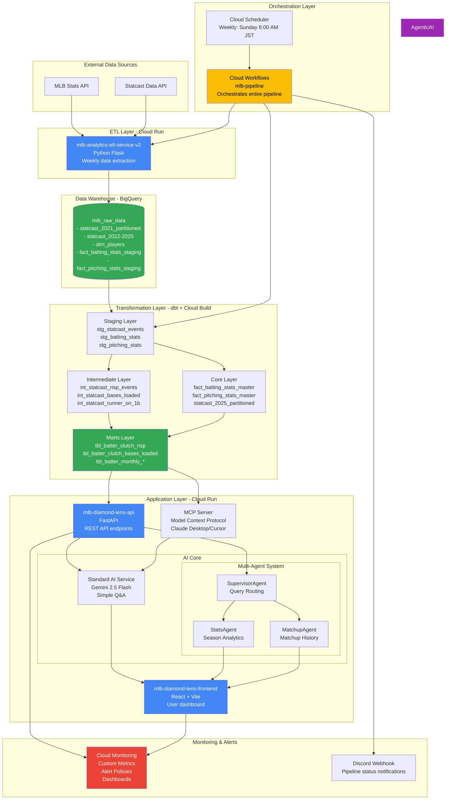
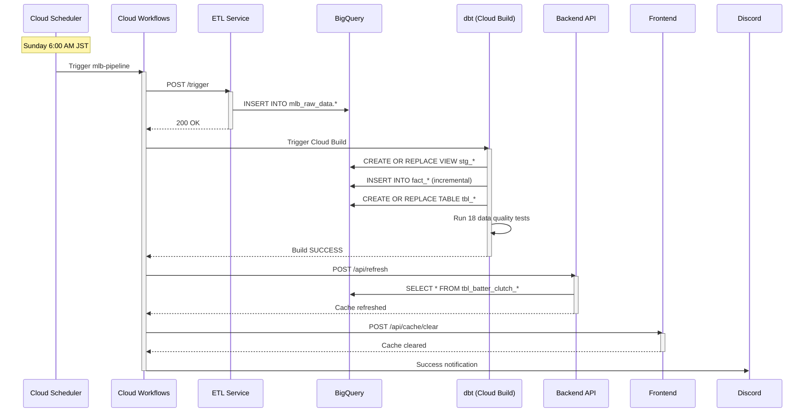
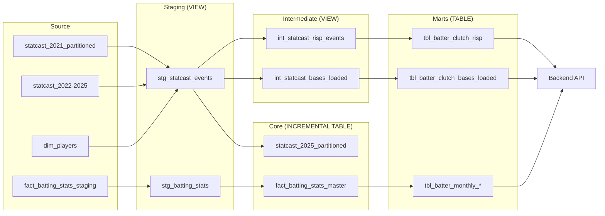

# MLB Analysis Dashboard - System Documentation

> Complete technical documentation for the MLB Analytics Dashboard platform

## Quick Navigation

| Section | Description |
|---------|-------------|
| [Architecture Overview](#architecture-overview) | System architecture and component relationships |
| [Service Catalog](#service-catalog) | All microservices and their details |
| [Data Flow](#data-flow) | How data flows through the system |
| [GCP Resources](#gcp-resources) | BigQuery, Cloud Run, and other GCP services |
| [Quick Commands](#quick-commands) | Common operations and CLI commands |

---

## Architecture Overview

### High-Level Architecture



### Technology Stack

| Layer | Technology | Purpose |
|-------|-----------|---------|
| **Data Sources** | MLB API, Statcast | Raw baseball statistics |
| **ETL** | Python Flask, Cloud Run | Data extraction and loading |
| **Data Warehouse** | BigQuery | Centralized data storage |
| **Transformation** | dbt, Cloud Build | Data modeling and quality |
| **Backend** | FastAPI, Cloud Run | REST API for analytics |
| **Frontend** | React + Vite, Cloud Run | User interface |
| **MCP Server** | Model Context Protocol | Claude Desktop/Cursor integration |
| **AI Agent** | LangGraph, Gemini 2.5 Flash | Multi-step reasoning & Tool use |
| **Orchestration** | Cloud Workflows, Cloud Scheduler | Pipeline automation |
| **Monitoring** | Cloud Monitoring, Discord Webhooks | Custom metrics, alerts, dashboards, pipeline notifications |

---

## Service Catalog

### 1. ETL Pipeline

| Property | Value |
|----------|-------|
| **Name** | mlb-analytics-etl-service-v2 |
| **Repository** | `mlb-analytics-etl` (private) |
| **Deployment** | Cloud Run (asia-northeast1) |
| **URL** | https://mlb-analytics-etl-service-v2-907924272679.asia-northeast1.run.app |
| **Trigger Endpoint** | `/trigger` (POST) |
| **Language** | Python 3.11 |
| **Framework** | Flask |
| **Responsibility** | Extract MLB data from source APIs and load to BigQuery raw tables |
| **Schedule** | Weekly (via Cloud Workflows) |
| **Dependencies** | MLB API, BigQuery `mlb_raw_data` |

### 2. dbt Transformation

| Property | Value |
|----------|-------|
| **Name** | mlb-analytics-data-dbt |
| **Repository** | https://github.com/takeshimx/mlb-analytics-data-dbt |
| **Deployment** | Cloud Build Trigger |
| **Trigger ID** | `18e20064-5449-4096-a733-95ecae5bea5c` |
| **Language** | SQL (dbt) |
| **Responsibility** | Transform raw data into analytics-ready tables with data quality tests |
| **Layers** | Staging → Intermediate → Core → Marts |
| **Materialization** | Views (staging/intermediate), Incremental (core), Tables (marts) |
| **Tests** | 18 data quality tests |
| **Dependencies** | BigQuery `mlb_raw_data`, `dbt_utils` package |

**Key Models:**
- **Staging**: `stg_statcast_events`, `stg_batting_stats`, `stg_pitching_stats`
- **Intermediate**: `int_statcast_risp_events`, `int_statcast_bases_loaded_events`
- **Core**: `fact_batting_stats_master` (incremental), `statcast_2025_partitioned`
- **Marts**: `tbl_batter_clutch_risp`, `tbl_batter_monthly_performance`

### 3. Backend API

| Property | Value |
|----------|-------|
| **Name** | mlb-diamond-lens-api |
| **Repository** | `mlb-diamond-lens-api` (private) |
| **Deployment** | Cloud Run (asia-northeast1) |
| **URL** | https://mlb-diamond-lens-api-907924272679.asia-northeast1.run.app |
| **Language** | Python 3.11 |
| **Framework** | FastAPI |
| **Responsibility** | Serve analytics data via REST API endpoints |
| **Endpoints** | `/api/refresh` (POST) - Refresh data cache |
| **Dependencies** | BigQuery `mlb_analytics_dash_25` |

### 4. Frontend Dashboard

| Property | Value |
|----------|-------|
| **Name** | mlb-diamond-lens-frontend |
| **Repository** | `mlb-diamond-lens-frontend` (private) |
| **Deployment** | Cloud Run (asia-northeast1) |
| **URL** | https://mlb-diamond-lens-frontend-907924272679.asia-northeast1.run.app |
| **Language** | JavaScript (React) |
| **Framework** | React + Vite |
| **Responsibility** | User-facing dashboard for MLB analytics |
| **Endpoints** | `/api/cache/clear` (POST) - Clear frontend cache |
| **Dependencies** | Backend API |

### 5. Agentic AI System (Supervisor + LangGraph)

| Property | Value |
|----------|-------|
| **Architecture** | Supervisor + Specialized Agents |
| **Core Engine** | LangGraph (StateGraph) |
| **LLM Model** | Gemini 2.0/2.5 Flash |
| **Supervisor** | `SupervisorAgent` - Parses intent and routes to Stats or Matchup |
| **Specialized Agents** | `StatsAgent` (Season/Trend), `MatchupAgent` (Head-to-Head) |
| **State Management** | `AgentState` (TypedDict with message history, UI meta, and specialized analytics data) |
| **Nodes per Agent** | Oracle (Planning), Action Tool, Synthesizer (Reporting) |
| **Capabilities** | Intelligently handles complex vs specific queries, automated visualization, and professional analyst reports |
| **Frontend Sync** | Structured `matchupData` or `chartData` triggers specialized UI components |

### 6. Orchestration

| Property | Value |
|----------|-------|
| **Name** | mlb-pipeline |
| **Repository** | https://github.com/takeshimx/mlb-pipeline-orchestration |
| **Deployment** | Cloud Workflows (asia-northeast1) |
| **Schedule** | Cloud Scheduler: `mlb-pipeline-weekly` |
| **Cron** | `0 6 * * 0` (Sunday 6:00 AM JST) |
| **Responsibility** | Orchestrate ETL → dbt → Backend → Frontend pipeline |
| **Notifications** | Discord webhook on success/failure |

**Pipeline Steps:**
1. Trigger ETL Cloud Run (`/trigger`)
2. Wait for ETL completion
3. Trigger dbt Cloud Build
4. Poll dbt build status (30s intervals)
5. Refresh Backend API (`/api/refresh`)
6. Clear Frontend cache (`/api/cache/clear`)
7. Send Discord notification

---

## Data Flow

### Weekly Pipeline Execution



### Data Transformation Layers



---

## GCP Resources

### BigQuery

**Project**: `tksm-dash-test-25`

**Datasets:**

| Dataset | Purpose | Materialization | Size |
|---------|---------|----------------|------|
| `mlb_raw_data` | Raw source data from ETL | Tables | ~50GB |
| `mlb_analytics_dash_25` | Production analytics (marts) | Tables + Views | ~10GB |
| `mlb_analytics_dev` | Development environment | Views | Minimal |
| `mlb_analytics_staging` | Pre-production testing | Views | Minimal |

**Key Tables:**

| Table | Type | Partitioning | Clustering | Rows | Description |
|-------|------|--------------|-----------|------|-------------|
| `mlb_raw_data.statcast_2021_partitioned` | TABLE | `game_date` (DATE) | `player_name`, `pitcher`, `batter` | ~2M | Statcast pitch-level data 2021 |
| `mlb_raw_data.dim_players` | TABLE | None | None | ~5K | Player dimension table |
| `mlb_analytics_dash_25.fact_batting_stats_master` | INCREMENTAL | `season` (INT64 RANGE) | None | ~50K | Weekly batting statistics |
| `mlb_analytics_dash_25.tbl_batter_clutch_risp` | TABLE | None | None | ~1K | Clutch hitting with RISP |

### Cloud Run Services

| Service Name | Region | Min Instances | Max Instances | Memory | CPU |
|--------------|--------|--------------|---------------|--------|-----|
| `mlb-analytics-etl-service-v2` | asia-northeast1 | 0 | 1 | 2GB | 1 |
| `mlb-diamond-lens-api` | asia-northeast1 | 0 | 10 | 1GB | 1 |
| `mlb-diamond-lens-frontend` | asia-northeast1 | 0 | 10 | 512MB | 1 |

### Cloud Build

**Trigger:**
- **Name**: `dbt-pipeline`
- **ID**: `18e20064-5449-4096-a733-95ecae5bea5c`
- **Repository**: mlb-analytics-data-dbt
- **Branch**: `main`
- **Config**: `cloudbuild.yaml`

### Cloud Workflows

**Workflow:**
- **Name**: `mlb-pipeline`
- **Region**: `asia-northeast1`
- **Service Account**: `cloud-build-dbt@tksm-dash-test-25.iam.gserviceaccount.com`

### Cloud Scheduler

**Job:**
- **Name**: `mlb-pipeline-weekly`
- **Schedule**: `0 6 * * 0` (Sunday 6:00 AM JST)
- **Target**: Cloud Workflows `mlb-pipeline`
- **Timezone**: `Asia/Tokyo`

### Service Accounts

| Email | Roles | Used By |
|-------|-------|---------|
| `cloud-build-dbt@tksm-dash-test-25.iam.gserviceaccount.com` | Workflows Invoker<br/>Cloud Run Invoker<br/>Cloud Build Editor<br/>BigQuery Data Editor | Cloud Workflows, Cloud Scheduler |

---

## Architecture Decisions

See [Architecture Decision Records](./adr/) for detailed design decisions.

**Key Decisions:**
- [ADR-001: Use BigQuery as Data Warehouse](./adr/001-use-bigquery.md)
- [ADR-002: Separate ETL, dbt, and Orchestration Repositories](./adr/002-separate-repos.md)
- [ADR-003: Weekly Batch Processing Strategy](./adr/003-weekly-batch-processing.md)
- [ADR-004: Cloud Workflows over Airflow](./adr/004-cloud-workflows-over-airflow.md)

---

## Quick Commands

### Pipeline Operations

```bash
# Manually trigger weekly pipeline
gcloud scheduler jobs run mlb-pipeline-weekly --location=asia-northeast1

# Run workflow directly (bypass scheduler)
gcloud workflows run mlb-pipeline --location=asia-northeast1

# View workflow execution history
gcloud workflows executions list mlb-pipeline --location=asia-northeast1 --limit=10

# Get specific execution details
gcloud workflows executions describe EXECUTION_ID \
  --workflow=mlb-pipeline \
  --location=asia-northeast1
```

### dbt Commands

```bash
# Run dbt locally (dev environment)
cd mlb-analytics-data-dbt
dbt run --target dev

# Run specific model
dbt run --select stg_statcast_events

# Run tests only
dbt test

# Generate documentation
dbt docs generate && dbt docs serve

# Full refresh (rebuild all incremental models)
dbt run --full-refresh
```

### BigQuery Queries

```sql
-- Check latest data in staging
SELECT MAX(game_date) as latest_game
FROM `tksm-dash-test-25.mlb_raw_data.statcast_2025`;

-- View marts data
SELECT * FROM `tksm-dash-test-25.mlb_analytics_dash_25.tbl_batter_clutch_risp`
WHERE game_year = 2025
ORDER BY barrels_count DESC
LIMIT 10;

-- Check incremental model status
SELECT season, COUNT(*) as rows
FROM `tksm-dash-test-25.mlb_analytics_dash_25.fact_batting_stats_master`
GROUP BY season
ORDER BY season DESC;
```

### Cloud Run Commands

```bash
# View ETL logs
gcloud logging read "resource.type=cloud_run_revision \
  AND resource.labels.service_name=mlb-analytics-etl-service-v2" \
  --limit=50 \
  --format=json

# Trigger ETL manually
curl -X POST \
  -H "Authorization: Bearer $(gcloud auth print-identity-token)" \
  https://mlb-analytics-etl-service-v2-907924272679.asia-northeast1.run.app/trigger

# Check Backend API health
curl https://mlb-diamond-lens-api-907924272679.asia-northeast1.run.app/health
```

---

## Monitoring & Observability

### Infrastructure Monitoring (Diamond Lens Application)

The Diamond Lens application has comprehensive monitoring and alerting implemented via Terraform:

**Uptime Checks**:
- Backend API health monitoring (`/health` endpoint)
- Frontend health monitoring
- Multi-region checks (USA, EUROPE, ASIA_PACIFIC)
- Frequency: 60 seconds
- Timeout: 10 seconds

**Alert Policies**:
- **Backend API Down**: Triggers when health check fails for 60+ seconds
- **Frontend Down**: Triggers when frontend is unreachable
- **High Memory Usage**: Alerts when memory > 80% for 5 minutes
- **High CPU Usage**: Alerts when CPU > 80% for 5 minutes
- **High Latency**: Alerts when API p95 latency > 5 seconds

**Custom Metrics** (Application Layer):
- `custom.googleapis.com/diamond-lens/api/latency` - API response time by endpoint
- `custom.googleapis.com/diamond-lens/api/errors` - Error count by type (validation, bigquery, llm, null_response)
- `custom.googleapis.com/diamond-lens/query/processing_time` - Query processing time by query type
- `custom.googleapis.com/diamond-lens/bigquery/latency` - BigQuery query latency

**Monitoring Dashboard**:
- Uptime metrics (backend/frontend availability)
- API latency (p50, p95, p99)
- CPU and memory utilization
- Instance count tracking
- Error rate monitoring

**Notification Channels**:
- Email alerts configured via Terraform
- All alerts include runbook links and severity classification

**Structured Logging**:
- JSON format logs with searchable fields
- Severity levels: DEBUG, INFO, WARNING, ERROR, CRITICAL
- Queryable fields: `query_type`, `error_type`, `latency_ms`, `status_code`

**Implementation**:
- Location: `diamond-lens/terraform/modules/monitoring/`
- Files: `uptime_checks.tf`, `alert_policies.tf`, `dashboard.tf`
- Documentation: `diamond-lens/docs/MONITORING.md`

### GCP Console Links

| Resource | Link |
|----------|------|
| **Cloud Workflows** | [View Executions](https://console.cloud.google.com/workflows/workflow/asia-northeast1/mlb-pipeline/executions?project=tksm-dash-test-25) |
| **Cloud Scheduler** | [View Jobs](https://console.cloud.google.com/cloudscheduler?project=tksm-dash-test-25) |
| **Cloud Build** | [View Builds](https://console.cloud.google.com/cloud-build/builds?project=tksm-dash-test-25) |
| **BigQuery** | [View Datasets](https://console.cloud.google.com/bigquery?project=tksm-dash-test-25) |
| **Cloud Run** | [View Services](https://console.cloud.google.com/run?project=tksm-dash-test-25) |
| **Cloud Logging** | [View Logs](https://console.cloud.google.com/logs?project=tksm-dash-test-25) |
| **Cloud Monitoring** | [View Dashboards](https://console.cloud.google.com/monitoring/dashboards?project=tksm-dash-test-25) |

### Pipeline Notifications

Pipeline status notifications are sent to Discord webhook:
- ✅ Success: Pipeline completed successfully
- ❌ Failure: ETL, dbt, or Backend step failed
- ⚠️ Warning: Non-critical errors (e.g., Frontend cache clear failed)

---

## Cost Breakdown

| Service | Monthly Cost (Estimated) | Notes |
|---------|-------------------------|-------|
| BigQuery Storage | $10-20 | ~60GB total storage |
| BigQuery Queries | $5-10 | Weekly pipeline queries |
| Cloud Run | $5-10 | Pay-per-use, minimal traffic |
| Cloud Build | $2-5 | Weekly dbt builds |
| Cloud Workflows | $0.15 | Weekly executions |
| Cloud Scheduler | $0.10 | Single job |
| **Total** | **$22-45/month** | Production costs |

---

## Troubleshooting

See [Runbooks](./runbooks/) for detailed troubleshooting guides:
- [Pipeline Failure Response](./runbooks/pipeline-failure.md)
- [dbt Build Errors](./runbooks/dbt-errors.md)
- [BigQuery Permission Issues](./runbooks/bigquery-permissions.md)

---

## Contributing

This documentation is maintained alongside the codebase. When making changes:
1. Update relevant service documentation in `/services/`
2. Update architecture diagrams if system design changes
3. Add new ADRs for significant decisions
4. Keep GCP resource inventory up-to-date

---

## Contact

**Owner**: takeshimx
**GitHub**: https://github.com/takeshimx
**Discord**: mlb-pipeline alerts channel
