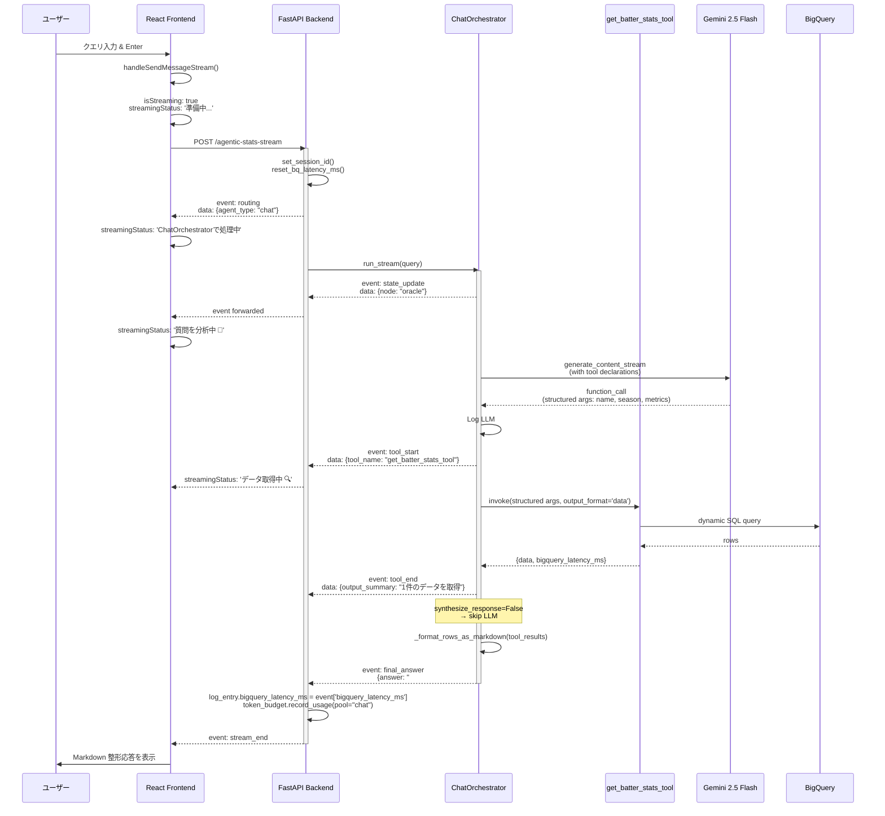
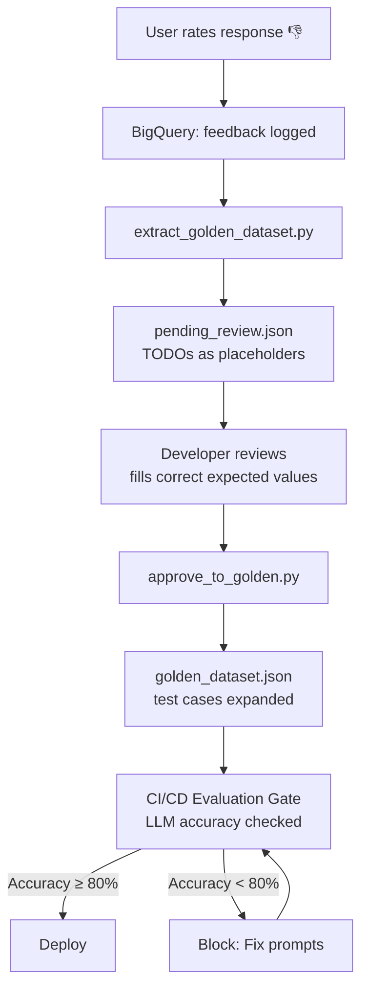
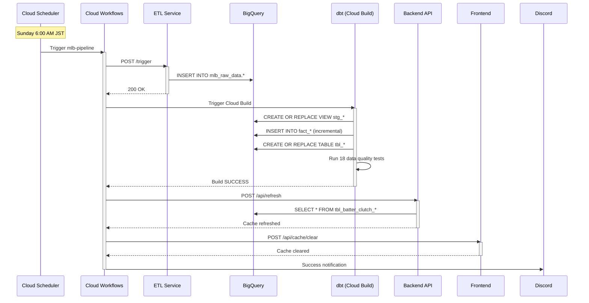
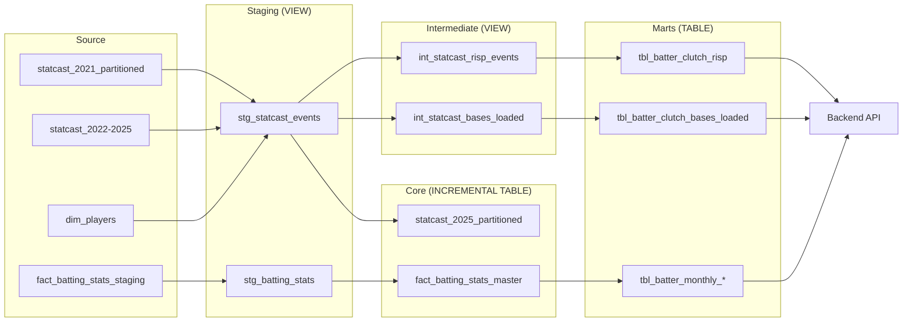

# MLB Analysis Dashboard - System Documentation

> Complete technical documentation for the MLB Analytics Dashboard platform

## Quick Navigation

| Section | Description |
|---------|-------------|
| [Architecture Overview](#architecture-overview) | System architecture and component relationships |
| [Service Catalog](#service-catalog) | All microservices and their details |
| [Data Flow](#data-flow) | How data flows through the system |
| [GCP Resources](#gcp-resources) | BigQuery, Cloud Run, and other GCP services |
| [Quick Commands](#quick-commands) | Common operations and CLI commands |

---

## Architecture Overview

### High-Level Architecture

```mermaid
graph TB
    subgraph "External Data Sources"
        MLB[MLB Stats API]
        Statcast[Statcast Data API]
    end

    subgraph "ETL Layer - Cloud Run"
        ETL[mlb-analytics-etl-service-v2<br/>Python Flask<br/>Weekly data extraction]
    end

    subgraph "Data Warehouse - BigQuery"
        RawData[(mlb_raw_data<br/>- statcast_2021_partitioned<br/>- statcast_2022-2025<br/>- dim_players<br/>- fact_batting_stats_staging<br/>- fact_pitching_stats_staging)]
    end

    subgraph "Transformation Layer - dbt + Cloud Build"
        Staging[Staging Layer<br/>stg_statcast_events<br/>stg_batting_stats<br/>stg_pitching_stats]
        Intermediate[Intermediate Layer<br/>int_statcast_risp_events<br/>int_statcast_bases_loaded<br/>int_statcast_runner_on_1b]
        Core[Core Layer<br/>fact_batting_stats_master<br/>fact_pitching_stats_master<br/>statcast_2025_partitioned]
        Marts[Marts Layer<br/>tbl_batter_clutch_risp<br/>tbl_batter_clutch_bases_loaded<br/>tbl_batter_monthly_*]
    end

    subgraph "Authentication Layer"
        FirebaseAuth[Firebase Authentication<br/>Google Sign-In<br/>ID Token Verification]
    end

subgraph "Application Layer - Cloud Run"
        Backend[mlb-diamond-lens-api<br/>FastAPI<br/>REST API endpoints]
        Frontend[mlb-diamond-lens-frontend<br/>React + Vite<br/>User dashboard]
        MCPServer[MCP Server<br/>Model Context Protocol<br/>Claude Desktop/Cursor]
        
        subgraph "AI Core (Refactored 2026-05-17)"
            StandardAI[Standard AI Service<br/>Gemini 2.5 Flash<br/>Simple Q&A]
            ChatOrch[ChatOrchestrator<br/>素の Gemini SDK + tool_use loop<br/>LLM 1 回 (synthesize_response=False)]
            StrategyAgent[StrategyAgent<br/>LangGraph: Planner→ParallelExec→Aggregator→Reflection→Strategist]
            CommonTools[Common Tools<br/>backend/app/services/tools/<br/>batter/pitcher/matchup × 2]
        end
    end

    subgraph "Orchestration Layer"
        Scheduler[Cloud Scheduler<br/>Weekly: Sunday 6:00 AM JST]
        Workflows[Cloud Workflows<br/>mlb-pipeline<br/>Orchestrates entire pipeline]
    end

    subgraph "HITL Feedback Loop"
        FeedbackUI[Feedback UI<br/>👍👎 + Category + Reason]
        FeedbackBQ[(BigQuery<br/>llm_interaction_logs<br/>user_rating, category, reason)]
        PendingReview[pending_review.json<br/>Human Review]
        GoldenDataset[golden_dataset.json<br/>LLM Evaluation]
    end

    subgraph "Monitoring & Alerts"
        CloudMonitoring[Cloud Monitoring<br/>Custom Metrics<br/>Alert Policies<br/>Dashboards]
        Discord[Discord Webhook<br/>Pipeline status notifications]
    end

    MLB --> ETL
    Statcast --> ETL
    ETL --> RawData

    RawData --> Staging
    Staging --> Intermediate
    Staging --> Core
    Intermediate --> Marts
    Core --> Marts

    Marts --> Backend
    Marts --> MCPServer
    Frontend --> FirebaseAuth
    FirebaseAuth --> Backend
    Backend --> StandardAI
    Backend --> ChatOrch
    Backend --> StrategyAgent
    MCPServer --> StandardAI
    ChatOrch --> CommonTools
    StrategyAgent --> CommonTools
    StandardAI --> Frontend
    ChatOrch --> Frontend
    StrategyAgent --> Frontend

    subgraph "ML Model Architecture (3-Layer Separation)"
        TrainingLayer[Training Layer<br/>Local/Notebook<br/>scripts/train_and_register_ft_transformer.py]
        ModelRegistry[Vertex AI Model Registry<br/>GCS Storage<br/>Model Versioning]
        InferenceLayer[Inference Layer - OPTIONAL<br/>Vertex AI Endpoint<br/>Managed Hosting]
        ApplicationLayer[Application Layer<br/>FastAPI on Cloud Run<br/>Local K-means (default)<br/>OR HTTP to Vertex AI]

        TrainingLayer --> ModelRegistry
        ModelRegistry -.Optional.-> InferenceLayer
        InferenceLayer -.HTTP.-> ApplicationLayer
        ModelRegistry -.Load.-> ApplicationLayer
    end

    Backend --> ApplicationLayer

    Scheduler --> Workflows
    Workflows --> ETL
    Workflows --> Staging
    Workflows --> Discord

    Frontend --> FeedbackUI
    FeedbackUI --> FeedbackBQ
    FeedbackBQ --> PendingReview
    PendingReview --> GoldenDataset

    Backend --> CloudMonitoring
    Frontend --> CloudMonitoring

    style FeedbackUI fill:#e91e63,color:#fff
    style FeedbackBQ fill:#34a853,color:#fff
    style GoldenDataset fill:#9c27b0,color:#fff
    style FirebaseAuth fill:#ff9800,color:#fff
    style ETL fill:#4285f4,color:#fff
    style Backend fill:#4285f4,color:#fff
    style Frontend fill:#4285f4,color:#fff
    style AgenticAI fill:#9c27b0,color:#fff
    style RawData fill:#34a853,color:#fff
    style Marts fill:#34a853,color:#fff
    style Workflows fill:#fbbc04,color:#000
    style CloudMonitoring fill:#ea4335,color:#fff
```

### ML Model Architecture: 3-Layer Separation of Concerns

The project follows modern MLOps best practices by **separating machine learning workflows into three distinct layers**. This architecture eliminates the anti-pattern of bundling heavy ML dependencies (PyTorch, 3.9GB) in production API containers.

#### Why This Architecture?

**❌ Old Approach (2024-2025): Monolithic**
- Training + Inference in FastAPI backend
- PyTorch in Cloud Run container → 3.9GB image size
- High memory usage, slow cold starts
- Tight coupling between training and serving

**✅ New Approach (2026): Separation of Concerns**
- **Training isolated** in notebooks/scripts (`scripts/train_and_register_ft_transformer.py`)
- **Models versioned** in Vertex AI Model Registry (GCS storage, ~$0.002/month)
- **Lightweight FastAPI** backend (no PyTorch in production)
- **Optional Vertex AI Endpoint** for high-scale inference
- **Easy rollback** and A/B testing with model versions

#### Layer Details

**[1] Training Layer (Local or Vertex AI Pipelines)**
- **Location**: `scripts/train_and_register_ft_transformer.py`, `analysis/kmeans_vs_ft_transformer.ipynb`
- **Execution**: Local environment with PyTorch installed
- **Output**: Trained FT-Transformer + K-means models
- **Registration**: Models uploaded to Vertex AI Model Registry (GCS)
- **Cost**: ~$0.002/month (GCS storage only)

**[2] Inference Layer (Vertex AI Endpoint) - OPTIONAL**
- **Purpose**: Managed model hosting for high-scale inference
- **Requirements**: Custom container for PyTorch models (not currently used)
- **Auto-scaling**: Managed by Vertex AI
- **Cost**: ~$73/month (24/7 n1-standard-2 instance)
- **Status**: **Not recommended** unless high-scale inference is required

**[3] Application Layer (FastAPI on Cloud Run) - LIGHTWEIGHT**
- **Default**: Local K-means clustering (lightweight, fast)
- **Optional**: HTTP calls to Vertex AI Endpoint (switchable via env var `USE_VERTEX_AI_ENDPOINT`)
- **Dependencies**: No PyTorch, scikit-learn only for local K-means
- **Fallback**: Automatic fallback to local K-means if Vertex AI fails
- **Cost**: Cloud Run costs only (minimal)

#### Current Implementation

**Training:**
```bash
# Local training with PyTorch
python scripts/train_and_register_ft_transformer.py --model-type batter --season 2025
```

**Model Registry:**
```python
# Models versioned in Vertex AI Model Registry
# Stored in GCS: gs://diamond-lens-models/ft-transformer/v1/
# Metadata logged to BigQuery: ml_model_registry
```

**Inference (Default):**
```python
# Local K-means in FastAPI (player_segmentation.py)
kmeans, scaler, X_scaled = self._load_or_fit("batter_segmentation", X)
df['cluster'] = kmeans.predict(X_scaled)
```

**Inference (Optional - Vertex AI):**
```python
# HTTP call to Vertex AI Endpoint (if USE_VERTEX_AI_ENDPOINT=true)
predictions = await self._predict_with_vertex_ai(endpoint_id, instances)
```

#### Cost Comparison

| Component | Current (Default) | Optional (Vertex AI) |
|-----------|------------------|----------------------|
| Model Storage | GCS: $0.002/month | GCS: $0.002/month |
| Compute | Cloud Run (included) | Vertex AI Endpoint: $73/month (24/7) |
| **Total** | **~$0** | **~$73/month** |

**→ Recommendation:** Use default local K-means unless high-scale inference is required.

### Technology Stack

| Layer | Technology | Purpose |
|-------|-----------|---------|
| **Data Sources** | MLB API, Statcast | Raw baseball statistics |
| **ETL** | Python Flask, Cloud Run | Data extraction and loading |
| **Data Warehouse** | BigQuery | Centralized data storage |
| **Transformation** | dbt, Cloud Build | Data modeling and quality |
| **Authentication** | Firebase Auth (Google Sign-In), Firebase Admin SDK | User authentication and server-side token verification |
| **Backend** | FastAPI, Cloud Run | REST API for analytics |
| **Frontend** | React + Vite, Cloud Run | User interface |
| **MCP Server** | Model Context Protocol | Claude Desktop/Cursor integration |
| **AI Agent (Chat)** | ChatOrchestrator (raw `google-genai` SDK + tool_use loop), Gemini 2.5 Flash | Single-LLM-call chat (`synthesize_response=False`) |
| **AI Agent (Strategy)** | LangGraph (StateGraph), Gemini 2.5 Flash | Plan-and-Execute + Parallel Fan-Out for strategy reports |
| **MLOps** | Prompt Registry, Golden Dataset, BigQuery Logging | Prompt versioning, LLM evaluation gate, I/O observability |
| **ML Monitoring** | Data Drift Service, Model Registry, GCS, BigQuery | Data drift detection (PSI/KS), model versioning & auto-baseline CI/CD gate |
| **Stuff+/Pitching+/Pitching++** | XGBoost, Model Registry, BigQuery | Pitch quality evaluation, sequence context modeling, pre-computed rankings, real-time inference |
| **HITL Feedback** | Feedback UI, BigQuery, pending_review.json | User feedback collection, golden dataset expansion pipeline |
| **LLM as a Judge** | 5 Judge Services, Gemini 2.0 Flash, BigQuery Logging | Automated multi-dimensional quality evaluation (parse, synthesizer, reflection, routing, drift alerts) |
| **BQ Embedding Quality Warning** | BigQuery ML, Vertex AI text-multilingual-embedding-002, VECTOR_SEARCH, asyncio.gather | Serverless semantic similarity warning: detects queries similar to past bad-rated ones; daily batch embedding via BQ Scheduled Query; zero always-on instances |
| **Hot/Slump Dashboard** | BigQuery (mart rolling-window tables), React | Detects hot streaks and slumps across BA/OPS/Barrel%/HH% over 7/14/28-day windows with multi-badge display |
| **Leaderboard** | BigQuery (mart tables), React | Batting/pitching season leaderboards with league and dynamic min-sample filters |
| **Standings** | MLB Stats API, FastAPI, React | Real-time division standings with win-rate color coding, no BQ dependency |
| **Live Monitor Board** | MLB Stats API, FastAPI, React | Multi-game real-time monitoring with rule-based anomaly detection and 40-second auto-polling |
| **Player Profile** | BigQuery, FastAPI, React, Recharts | Per-player dashboard with debounced autocomplete search and multi-chart visualization (Radar, Composed, Area, Scatter) |
| **Pitcher Fatigue Analysis** | BigQuery (statcast_master), FastAPI, React, Recharts | Within-game velocity degradation tracking vs. league average baseline |
| **Pitcher Whiff Predictor** | BigQuery (statcast_master), FastAPI, React, Recharts | Multi-condition whiff rate prediction per pitch type with 7-dimension situational filters |
| **Voice Input** | MediaRecorder API (browser), FastAPI (transcription), React | Microphone audio capture with backend speech-to-text and direct query injection |
| **Rate Limiting** | Custom ASGI Middleware, slowapi, In-Memory Counters | Multi-tier rate limiting (Global/Session/Endpoint) + LLM token budget |
| **Orchestration** | Cloud Workflows, Cloud Scheduler | Pipeline automation |
| **Monitoring** | Cloud Monitoring, Discord Webhooks | Custom metrics, alerts, dashboards, pipeline notifications |

---

## Service Catalog

### 1. ETL Pipeline

| Property | Value |
|----------|-------|
| **Name** | mlb-analytics-etl-service-v2 |
| **Repository** | `mlb-analytics-etl` (private) |
| **Deployment** | Cloud Run (asia-northeast1) |
| **URL** | https://mlb-analytics-etl-service-v2-907924272679.asia-northeast1.run.app |
| **Trigger Endpoint** | `/trigger` (POST) |
| **Language** | Python 3.11 |
| **Framework** | Flask |
| **Responsibility** | Extract MLB data from source APIs and load to BigQuery raw tables |
| **Schedule** | Weekly (via Cloud Workflows) |
| **Dependencies** | MLB API, BigQuery `mlb_raw_data` |

### 2. dbt Transformation

| Property | Value |
|----------|-------|
| **Name** | mlb-analytics-data-dbt |
| **Repository** | https://github.com/takeshimx/mlb-analytics-data-dbt |
| **Deployment** | Cloud Build Trigger |
| **Trigger ID** | `18e20064-5449-4096-a733-95ecae5bea5c` |
| **Language** | SQL (dbt) |
| **Responsibility** | Transform raw data into analytics-ready tables with data quality tests |
| **Layers** | Staging → Intermediate → Core → Marts |
| **Materialization** | Views (staging/intermediate), Incremental (core), Tables (marts) |
| **Tests** | 18 data quality tests |
| **Dependencies** | BigQuery `mlb_raw_data`, `dbt_utils` package |

**Key Models:**
- **Staging**: `stg_statcast_events`, `stg_batting_stats`, `stg_pitching_stats`
- **Intermediate**: `int_statcast_risp_events`, `int_statcast_bases_loaded_events`
- **Core**: `fact_batting_stats_master` (incremental), `statcast_2025_partitioned`
- **Marts**: `tbl_batter_clutch_risp`, `tbl_batter_monthly_performance`

### 3. Authentication (Firebase)

| Property | Value |
|----------|-------|
| **Provider** | Firebase Authentication (Google Sign-In) |
| **Frontend SDK** | Firebase JS SDK (`signInWithPopup` + `GoogleAuthProvider`) |
| **Backend SDK** | Firebase Admin SDK (`firebase-admin`) |
| **Middleware** | `FirebaseAuthMiddleware` (Pure ASGI) |
| **Token Format** | `Authorization: Bearer <Firebase ID Token>` |
| **Public Paths** | `/`, `/health`, `/debug/routes`, `/docs`, `/openapi.json`, `/redoc` |
| **User Tracking** | `user_id` extracted from token, logged to BigQuery via `llm_logger_service.py` |
| **CSP** | `nginx.conf` allows `apis.google.com`, `gstatic.com`, `accounts.google.com`, `*.firebaseapp.com` |

**Authentication Flow:**
1. User clicks "Sign in with Google" on frontend
2. Firebase SDK opens Google OAuth popup and returns ID token
3. Frontend attaches `Authorization: Bearer <token>` to all API requests
4. Backend `FirebaseAuthMiddleware` intercepts requests and verifies token via Firebase Admin SDK
5. Verified `user_id` and `email` are stored in `request.state` for downstream use
6. Unauthenticated requests to protected endpoints receive `401 Unauthorized`

### 4. Backend API

| Property | Value |
|----------|-------|
| **Name** | mlb-diamond-lens-api |
| **Repository** | `mlb-diamond-lens-api` (private) |
| **Deployment** | Cloud Run (asia-northeast1) |
| **URL** | https://mlb-diamond-lens-api-907924272679.asia-northeast1.run.app |
| **Language** | Python 3.11 |
| **Framework** | FastAPI |
| **Responsibility** | Serve analytics data via REST API endpoints |
| **Endpoints** | `/api/refresh` (POST) - Refresh data cache |
| **Dependencies** | BigQuery `mlb_analytics_dash_25` |

### 5. Frontend Dashboard

| Property | Value |
|----------|-------|
| **Name** | mlb-diamond-lens-frontend |
| **Repository** | `mlb-diamond-lens-frontend` (private) |
| **Deployment** | Cloud Run (asia-northeast1) |
| **URL** | https://mlb-diamond-lens-frontend-907924272679.asia-northeast1.run.app |
| **Language** | JavaScript (React) |
| **Framework** | React + Vite |
| **Responsibility** | User-facing dashboard for MLB analytics |
| **Endpoints** | `/api/cache/clear` (POST) - Clear frontend cache |
| **Dependencies** | Backend API |

### 5b. MetricFlow Cloud Run Server (NEW 2026)

| Property | Value |
|----------|-------|
| **Name** | mlb-metricflow-server |
| **Repository** | `diamond-lens` (this repo) under `metricflow/` |
| **Deployment** | Cloud Run (asia-northeast1) |
| **Authentication** | Cloud Run service-to-service OIDC ID tokens (`roles/run.invoker`); `--no-allow-unauthenticated` |
| **Ingress** | `all` (private auth via SA, no public access without token) |
| **Service Account** | `mlb-metricflow-sa@tksm-dash-test-25.iam.gserviceaccount.com` (`roles/bigquery.dataViewer`, `roles/bigquery.jobUser`) |
| **Language** | Python 3.11 |
| **Framework** | FastAPI + dbt-metricflow CLI |
| **Endpoints** | `POST /query`, `GET /metrics`, `GET /dimensions`, `GET /health` |
| **Responsibility** | Wraps `mf` CLI as HTTP. Resolves Semantic Layer queries (metrics + filters) into BigQuery SQL via dbt project |
| **dbt Project** | git submodule of `mlb-analytics-data-dbt` mounted at `/app/dbt_project`. Single source of truth for semantic_models / metrics |
| **Secret** | `github-pat` in Secret Manager (PAT for Cloud Build to clone the private dbt submodule) |
| **Startup** | Runs `dbt parse` to materialize `target/semantic_manifest.json`, then serves requests |
| **Dependencies** | BigQuery `mlb_analytics_dash_25`, `mlb-analytics-data-dbt` (submodule) |
| **Caller** | Backend `query_semantic_metrics_tool` only (when `USE_SEMANTIC_LAYER=true`) |

**Why a separate Cloud Run service**: Keeps heavy dbt + MetricFlow dependencies out of the main backend image; lets the dbt project version (submodule SHA) be advanced independently of backend code releases; can be scaled, monitored, and IAM-restricted independently.

### 6. Agentic AI System (ChatOrchestrator + StrategyAgent)

> **2026-05-17 Refactored**: Chat path migrated from `SupervisorAgent` + 4 LangGraph sub-agents to a **single `ChatOrchestrator`** built on raw `google-genai` SDK with tool_use loop. Reduces LLM calls per chat request from 4 to 1 (`synthesize_response=False` default). `StrategyAgent` retains LangGraph.

#### Chat Path (`ChatOrchestrator`)

| Property | Value |
|----------|-------|
| **Architecture** | Single Orchestrator + Common Tools (no sub-agents, no LangGraph) |
| **Core Engine** | Raw `google-genai` SDK with `tool_use` loop (`MAX_TOOL_ITERATIONS=6`) |
| **LLM Model** | Gemini 2.5 Flash |
| **NLU** | Orchestrator's outer LLM extracts structured args via `tool_use` directly (no internal NLU LLM call) |
| **Tool Set** | `backend/app/services/tools/`: `get_batter_stats_tool`, `get_pitcher_stats_tool`, `mlb_matchup_history_tool`, `mlb_matchup_analytics_tool` (legacy METRIC_MAP path) |
| **Semantic Layer Path** | When `USE_SEMANTIC_LAYER=true`: swaps to `query_semantic_metrics_tool` (dbt MetricFlow). Cloud Run only (local lacks SA auth) |
| **Tool Output Mode** | `output_format='data'` default — tool returns raw rows without internal LLM narration |
| **Response Synthesis** | `synthesize_response=False` default — orchestrator returns Markdown-formatted tool data directly. `True` enables an extra LLM call to compose natural language |
| **Token Budget Pool** | `chat` (Phase 3-A) |
| **Capabilities** | Single-LLM-call chat, complex query routing via tool_use, automated visualization, table/chart/matchup card structured output |
| **Streaming Mode** | Server-Sent Events (SSE) via `/api/v1/qa/agentic-stats-stream`. Maintains the legacy event contract (`routing`, `state_update`, `tool_start`, `tool_end`, `token`, `final_answer`) for frontend compatibility |

#### Strategy Path (`StrategyAgent`, unchanged)

| Property | Value |
|----------|-------|
| **Architecture** | LangGraph StateGraph (5 nodes) |
| **Nodes** | Planner → ParallelExecutor → Aggregator → Reflection → Strategist |
| **Reflection Loop** | Active. Detects empty results / SQL errors, rewrites the query, retries (max 2). Logged to BQ as `is_retry`, `retry_count`, `retry_reason` |
| **Token Budget Pool** | `report` (Phase 3-A) |
| **Endpoint** | `POST /api/v1/strategy-report` |

### 6.1. Real-Time Streaming Architecture (SSE)

> **2026-05-17 Refactored**: Backend engine migrated from LangGraph `astream_events` to `ChatOrchestrator.run_stream()` (raw `google-genai` SDK). SSE event contract is preserved for frontend compatibility.

| Property | Value |
|----------|-------|
| **Protocol** | Server-Sent Events (SSE) |
| **Content-Type** | `text/event-stream` |
| **Backend Engine** | FastAPI StreamingResponse + AsyncGenerator |
| **Orchestrator Engine** | `ChatOrchestrator.run_stream()` — raw `google-genai` `generate_content_stream()` with tool_use loop |
| **Event Types** | `routing` (agent_type='chat' fixed for compatibility), `state_update`, `tool_start`, `tool_end`, `token`, `final_answer`, `stream_end`, `error` |
| **Frontend** | ReadableStream API with SSE parsing |
| **UI Updates** | Real-time streaming status display: `準備中` → `質問を分析中 🤔` → `データ取得中 🔍` → `回答生成中 ✍️` |
| **Token Accumulation** | LLM tokens streamed incrementally and accumulated in frontend |
| **BQ Latency Propagation** | Tool returns `bigquery_latency_ms` in its data dict → Orchestrator aggregates → passes via `final_answer` event → endpoint writes to `LLMLogEntry.bigquery_latency_ms` (ContextVar bypassed since it fails under StreamingResponse) |

**Streaming Data Flow:**



**Key Implementation Details:**

| Component | Implementation | Purpose |
|-----------|---------------|---------|
| **Backend Endpoint** | `ai_analytics_endpoints.py` Line 372-432 | SSE streaming endpoint `/qa/agentic-stats-stream` |
| **Streaming Service** | `ai_agent_service.py` Line 558-780 | `run_mlb_agent_stream()` with LangGraph `astream_events()` |
| **SSE Formatter** | `utils/streaming.py` | `format_sse()` converts dict to SSE format |
| **Frontend Handler** | `App.jsx` Line 1167-1371 | `handleSendMessageStream()` with ReadableStream parsing |
| **Event Routing** | `handleSendMessageStream()` switch cases | Maps event types to UI state updates |
| **Token Accumulation** | Backend: `accumulated_answer` variable | Collects tokens during streaming, sends as `final_answer` |
| **Reflection Loop** | `should_reflect()` + `reflection_node()` in each agent | Detects SQL errors/empty results, feeds diagnostic context to LLM, retries with corrected parameters (max 2 retries) |
| **Reflection State** | `AgentState`: `retry_count`, `max_retries`, `last_error`, `last_query_result_count`, `original_user_intent` | Tracks reflection loop state across graph nodes |
| **LLM Logging (Reflection)** | `llm_logger_service.py`: `is_retry`, `retry_count`, `retry_reason` | Logs reflection loop metadata to BigQuery for observability |

### 7. MLOps: Prompt Versioning, LLM I/O Logging & Evaluation Gate

| Property | Value |
|----------|-------|
| **Prompt Versioning** | Externalized prompts as versioned text files (`parse_query_v1.txt`, `routing_v1.txt`) |
| **Prompt Registry** | `prompt_registry.py` manages prompt loading and version switching |
| **Context Caching** | `prompt_cache_service.py` registers long fixed prefixes (`parse_query_v1`, `oracle_semantic_v1`) via `client.caches.create()`; reduces Gemini input billing from ~$0.30/M to ~$0.03/M tokens (~1/10). Per-instance in-memory registry with 1-hour TTL and fail-open fallback |
| **LLM I/O Logging** | `llm_logger_service.py` logs all LLM interactions to BigQuery asynchronously |
| **Logged Fields** | User query, parsed result, prompt version, latency, errors, routing result, user feedback, reflection loop metadata (is_retry, retry_count, retry_reason), cached_tokens (Context Caching hit ratio) |
| **Evaluation Gate** | `evaluate_llm_accuracy.py` runs LLM against golden dataset in CI/CD |
| **Golden Dataset** | `golden_dataset.json` with test cases covering batting, pitching, splits, career (expandable via HITL) |
| **Pass Threshold** | 80% accuracy required to proceed with deployment |
| **Critical Fields** | `query_type` mismatch causes immediate failure regardless of overall accuracy |

### 8a. Rate Limiting & Quota Management

| Property | Value |
|----------|-------|
| **Global Rate Limit** | 100 requests/minute (all users combined) via custom ASGI middleware (`RateLimitMiddleware`) |
| **Per-Session Rate Limit** | 20 requests/minute per user (keyed by Firebase user_id > Session ID > IP) |
| **Per-Endpoint Rate Limit** | Configurable via slowapi decorators: AI chat (5/min), Player stats (10/min), Statistics (10/min) |
| **LLM Token Budget** | 1,000,000 tokens/day (in-memory counter, auto-resets at UTC midnight) |
| **Storage** | In-memory (`dict` + `threading.Lock`) — no Redis dependency |
| **Algorithm** | Fixed-window (1-minute windows, UNIX timestamp // 60) |
| **429 Response** | Returns `Retry-After` header with seconds until next window |
| **Monitoring** | Rejections logged to Cloud Monitoring (`rate_limit/rejections`) and BigQuery (`llm_interaction_logs`) |
| **Configuration** | All limits configurable via `.env` / `settings.py` without code changes |
| **Exempt Paths** | `/`, `/health`, `/debug/routes`, `/docs`, `/openapi.json`, `/redoc` |

**Middleware Execution Order:**
```
Request → RequestIDMiddleware → RateLimitMiddleware (Global/Session check) → FirebaseAuthMiddleware → Per-Endpoint slowapi → Endpoint Handler
```

**Key Files:**

| File | Purpose |
|------|---------|
| `middleware/rate_limit.py` | Custom ASGI middleware for Global/Per-Session rate limiting |
| `api/rate_limit.py` | slowapi `Limiter` instance with session/IP key function |
| `services/token_budget_service.py` | Daily LLM token budget tracking (in-memory singleton) |
| `config/settings.py` | All rate limit configuration values |
| `main.py` | Middleware registration, slowapi exception handler, 429 logging |

### 8b. Human-in-the-Loop (HITL) Feedback System

| Property | Value |
|----------|-------|
| **Feedback UI** | Thumbs up/down on every bot response, detailed form for negative ratings |
| **Feedback Categories** | `inaccurate`, `slow`, `irrelevant`, `wrong_player`, `wrong_stats` |
| **Storage** | Feedback logged to BigQuery `llm_interaction_logs` table with `user_rating`, `feedback_category`, `feedback_reason` |
| **API Endpoint** | `POST /api/v1/qa/feedback` |
| **Extract Script** | `extract_golden_dataset.py` fetches bad-rated queries → `pending_review.json` |
| **Approve Script** | `approve_to_golden.py` promotes reviewed cases → `golden_dataset.json` |
| **Review Process** | Manual: developer edits `pending_review.json`, fills correct `expected` values, sets `reviewed: true` |

**HITL Feedback Loop**:



### 8c. ML Model Monitoring & Data Drift Detection

| Property | Value |
|----------|-------|
| **Data Drift Service** | `data_drift_service.py` — KS test, PSI, mean shift analysis |
| **Model Registry** | `model_registry_service.py` — train, register, load, promote model versions |
| **Model Storage** | GCS: `gs://diamond-lens-models/models/{model_type}/{version}/model.joblib` |
| **Metadata Storage** | BigQuery: `ml_model_registry` table (version, algorithm, training_season, gcs_path, model_params, is_active) |
| **Supported Algorithms** | `algorithm` column: KMeans, FT-Transformer, LightGBM, etc. with generic `model_params` JSON |
| **Drift Detection** | PSI (Warning ≥ 0.1, Critical ≥ 0.2), KS test (p-value < 0.05), mean shift % |
| **Auto-Baseline** | `detect-drift` endpoint auto-detects `baseline_season` from active model's `training_season` |
| **CI/CD Gate** | `check_data_drift.py` blocks deployment on critical drift (exit code 1) |
| **Monitoring Logger** | `ml_monitoring_logger.py` logs drift reports to BigQuery |
| **Segmentation Integration** | `player_segmentation.py` loads active model from registry, falls back to on-the-fly fitting |

**API Endpoints:**
- `POST /api/v1/ml-monitoring/detect-drift` — Data drift detection (auto-baseline from registry)
- `GET /api/v1/ml-monitoring/drift-history` — Historical drift reports
- `GET /api/v1/ml-monitoring/drift-summary` — Latest drift status
- `POST /api/v1/model-registry/train` — Train & register new model version
- `GET /api/v1/model-registry/versions` — List registered versions
- `POST /api/v1/model-registry/promote` — Promote version to active
- `GET /api/v1/model-registry/active` — Get current active version

**Key Files:**

| File | Purpose |
|------|---------|
| `services/data_drift_service.py` | Core drift detection logic (PSI, KS test, mean shift) |
| `services/ft_transformer.py` | FT-Transformer encoder: self-supervised feature embedding for player segmentation |
| `services/model_registry_service.py` | Model Registry: train, GCS upload, BigQuery metadata, load, promote |
| `services/ml_monitoring_logger.py` | Drift report logging to BigQuery |
| `services/player_segmentation.py` | Loads active model from registry or fits new |
| `endpoints/drift_monitoring_endpoints.py` | Drift detection API endpoints with auto-baseline |
| `endpoints/model_registry_endpoints.py` | Model registry API endpoints |
| `scripts/check_data_drift.py` | CI/CD drift check gate script |

### 8d. Stuff+ / Pitching+ / Pitching++ Pitch Quality Evaluation

| Property | Value |
|----------|-------|
| **Algorithm** | XGBoost Regressor (500 estimators, max_depth=6, early stopping) |
| **Target Variable** | `delta_pitcher_run_exp` (pitch-level run expectancy change) |
| **Stuff+ Features (11)** | `release_speed`, `release_spin_rate`, `spin_axis`, `pfx_x`, `pfx_z`, `release_extension`, `release_pos_x`, `release_pos_z`, `api_break_z_with_gravity`, `api_break_x_arm`, `arm_angle` |
| **Pitching+ Features (13)** | Stuff+ features + `plate_x`, `plate_z` |
| **Pitching++ Features** | Pitching+ features + command (`zone_distance`) + count (`balls`, `strikes`) + tunneling (`release_diff`, `speed_diff`, `prev_pfx_z`) |
| **Scoring** | z-score normalization (100 = league average, 15 points = 1σ) |
| **Aggregation** | Pitcher × pitch type level with minimum pitch count filter (default: 100) |
| **Pre-computed Rankings** | BigQuery `stuff_plus_rankings` table for fast retrieval |
| **Real-time Inference** | On-demand prediction using active model from Model Registry |
| **Gap Analysis** | Stuff+ vs Pitching+ comparison classifies pitchers as stuff-dominant, command-dominant, or balanced |
| **Model Storage** | GCS via Model Registry (model.joblib + rankings.csv + metadata.json) |
| **Validation** | Pitch-level RMSE/R², aggregated Pearson/Spearman correlation |

**API Endpoints:**
- `GET /api/v1/stuff-plus/rankings` — Stuff+, Pitching+, or Pitching++ leaderboard (paginated, sortable)
- `GET /api/v1/stuff-plus/pitcher/{pitcher_id}` — Real-time per-pitcher pitch-level scores
- `GET /api/v1/stuff-plus/pitcher/{pitcher_id}/compare` — Stuff+ vs Pitching+ gap analysis

**Key Files:**

| File | Purpose |
|------|---------|
| `services/stuff_plus_service.py` | Inference service: rankings retrieval, real-time prediction, gap analysis |
| `endpoints/stuff_plus_endpoints.py` | API endpoints for rankings, pitcher detail, model comparison |
| `scripts/train_stuff_plus.py` | Training pipeline: data fetch → XGBoost training → ranking computation → GCS + Model Registry registration |
| `analysis/stuff_plus.ipynb` | Model development and validation notebook |

**Training Pipeline:**
```bash
# Train Stuff+, Pitching+, and Pitching++ models for a given season
python scripts/train_stuff_plus.py --season 2025 --min-pitches 100
```

### 8e. LLM as a Judge — Automated Quality Evaluation

| Property | Value |
|----------|-------|
| **Architecture** | 5 independent Judge services + batch evaluation pipeline |
| **LLM Model** | Gemini 2.0 Flash (via `GEMINI_API_KEY_V2`) |
| **Evaluation Mode** | Batch (BQ log → sample → Judge) — zero impact on production latency |
| **Logging** | Raw step I/O logged to `llm_interaction_logs` via `llm_logger_service.py` |
| **E2E Script** | `evaluate_with_llm_judge.py` for parse accuracy regression testing |

**5 Judge Services:**

| # | Judge | Service File | Evaluation Dimensions | Output |
|---|---|---|---|---|
| 1 | Parse Accuracy | `llm_judge_service.py` | query_type, metrics extraction, player name resolution, intent understanding (1-5 each) | `JudgeVerdict` |
| 2 | Synthesizer Quality | `synthesizer_judge_service.py` | Factual accuracy, analytical depth, language quality, structure, completeness (1-5 each) | `SynthesizerVerdict` |
| 3 | Reflection Decision | `reflection_judge_service.py` | Trigger appropriateness, root cause identification, correction quality, over-correction risk (1-5 each) | `ReflectionVerdict` |
| 4 | Routing Accuracy | `routing_judge_service.py` | Route accuracy, ambiguity handling, reasoning quality (1-5 each) | `RoutingVerdict` |
| 5 | Drift Alert Quality | `drift_alert_judge_service.py` | Statistical validity, practical significance, actionability, domain relevance (1-5 each) | `DriftAlertVerdict` |

**Operational Architecture:**

```
[Real-time] User query → Normal processing flow
                → Log step I/O to BigQuery (0 additional Gemini calls)

[Batch]     BQ logs → Sample extraction → 5 Judges evaluate → Results to BQ
            (Frequency and sample size configurable)
```

**Key Files:**

| File | Purpose |
|------|---------|
| `services/llm_judge_service.py` | Parse accuracy Judge with METRIC_MAP key validation |
| `services/synthesizer_judge_service.py` | Synthesizer output quality Judge (agent/simple path-aware) |
| `services/reflection_judge_service.py` | Reflection loop decision quality Judge |
| `services/routing_judge_service.py` | Supervisor routing accuracy Judge (two-way player handling) |
| `services/drift_alert_judge_service.py` | Data drift alert quality Judge (model-specific domain context) |
| `services/llm_logger_service.py` | BQ logging with Judge-ready fields (`reflection_pre_query`, `reflection_post_query`, `synthesizer_source_data`) |
| `scripts/evaluate_with_llm_judge.py` | E2E evaluation script for golden dataset |
| `tests/golden_dataset.json` | Golden dataset with batting, pitching, edge cases (14 cases) |

### 8f. Embedding-Based Semantic Drift Detection

| Property | Value |
|----------|-------|
| **Approach** | BQ ML `ML.GENERATE_EMBEDDING` + `ML.DISTANCE (COSINE)` |
| **Granularity** | Per pitch type (`pitch_name`) — 4-Seam Fastball, Slider, Curveball, Changeup, etc. |
| **Snapshot Cadence** | Weekly (Monday 03:00 UTC via BQ Scheduled Query) |
| **Baseline** | 4-week rolling centroid (average embedding over prior 4 weeks) |
| **Embedding Model** | `query_embedding_model` (Vertex AI `text-multilingual-embedding-002`) |
| **Drift Thresholds** | Stable < 0.10 ≤ Warning < 0.20 ≤ Critical |
| **Output** | `semantic_drift` field appended to existing `DriftReport` |

**Why per pitch type**: Each pitch type has completely different velocity ranges, spin rates, and movement profiles (e.g., 4-seam fastball vs. curveball). Aggregating across all pitch types would mask meaningful changes such as a league-wide velocity drop on fastballs or a shift in slider sweep angle.

**Metrics per pitch type** (sourced from `statcast_master`):

| Metric | Column | Description |
|--------|--------|-------------|
| Velocity | `release_speed` | Pitch velocity at release |
| Spin rate | `release_spin_rate` | Spin rate (RPM) |
| Horizontal break | `pfx_x` | Induced horizontal movement |
| Vertical break (no gravity) | `pfx_z` | Induced vertical movement |
| Vertical break (with gravity) | `api_break_z_with_gravity` | Total vertical drop |
| Extension | `release_extension` | Release point distance from rubber |
| Usage rate | `COUNT(*) / total` | Pitch type usage fraction |
| Run value | `delta_pitcher_run_exp` | Average run expectancy per pitch |

**Key Files:**

| File | Purpose |
|------|---------|
| `services/bq_drift_embedding_service.py` | Cosine distance computation; graceful fallback when no snapshot data |
| `services/data_drift_service.py` | `semantic_drift` field added to `DriftReport` and `to_dict()` |
| `queries/create_pitcher_metrics_snapshots.sql` | Table DDL for weekly snapshots |
| `queries/scheduled_pitcher_embedding_weekly.sql` | Weekly BQ Scheduled Query |

### 8g. Advanced Stats Dashboard

| Property | Value |
|----------|-------|
| **Score Scale** | OPS+-style: `100 + composite_z × 15` (100 = league avg, ±15 = ±1σ) |
| **Normalization** | Per-season z-score via `PARTITION BY game_year` on all components |
| **Re-standardization** | `composite_raw` re-z-scored to guarantee std=1 before final conversion |
| **Data Source** | BigQuery views over `statcast_master` |
| **Auth** | Firebase ID Token required (FirebaseAuthMiddleware) |

**Pitching metrics (P-series)**: P1 Pitch Tunnel, P2 Pressure Dominance (SP), P3 Stamina, P4 Two-Strike Finisher, P6 Arsenal Effectiveness, P8 Platoon Neutrality

**Batting metrics (B-series)**: B1 Swing Efficiency (2024+), B2 Plate Discipline, B3 Clutch Hitting, B4 Contact Consistency, B6 Spray Mastery

**Key files**:

| File | Purpose |
|------|---------|
| `queries/pitch_tunnel_stats.sql` | P1 — deception_rate z-score |
| `queries/pitch_pressure_dominance_index_sp.sql` | P2 — high-LI composite, SP filter |
| `queries/pitch_stamina_score.sql` | P3 — slope regression + TTO delta |
| `queries/pitch_2strikes_finisher_score.sql` | P4 — whiff + put-away wOBA |
| `queries/pitch_arsenal_effectiveness_score_v2.sql` | P6 — entropy + effectiveness |
| `queries/pitch_platoon_neutrality_score.sql` | P8 — L/R wOBA diff |
| `queries/batter_plate_discipline_score.sql` | B2 — O/Z-swing + decision value |
| `queries/batter_clutch_hitting_index.sql` | B3 — leverage-split wOBA delta |
| `queries/batter_contact_consistency_score.sql` | B4 — CV_xwOBA + hard-hit |
| `queries/batter_swing_efficiency_score.sql` | B1 — bat tracking efficiency |
| `queries/batter_spray_mastery_score_v2_oppo_weighted.sql` | B6 — spray entropy + oppo xwOBA |
| `backend/app/services/advanced_stats_service.py` | BQ query execution + response shaping |
| `frontend/src/components/AdvancedStatsPitching.jsx` | Pitching stats UI |
| `frontend/src/components/AdvancedStatsBatting.jsx` | Batting stats UI |

---

### 8h. Live Game Updates — 試合速報

| Property | Value |
|----------|-------|
| **Data Source** | MLB Stats API (`statsapi.mlb.com`) — no BQ dependency |
| **Update Model** | Pull-on-demand (client polls; no server-side push) |
| **Parallelism** | `asyncio.gather` for concurrent multi-game live feed fetching |
| **Timezone** | UTC → JST conversion via `ZoneInfo("Asia/Tokyo")` |
| **Auth** | Firebase ID Token required (FirebaseAuthMiddleware) |

**Data returned per live game**: pitcher/batter names, count (B-S-O), score, inning + half, runners on base, full pitch sequence for current at-bat (pitch type, call, speed)

**Key files**:

| File | Purpose |
|------|---------|
| `backend/app/services/live_game_service.py` | MLB API integration, response shaping |
| `backend/app/api/endpoints/live_game_endpoints.py` | FastAPI route definitions |

### 8i. Hot / Slump Dashboard

| Property | Value |
|----------|-------|
| **Data Source** | BigQuery mart tables (rolling-window aggregates) |
| **Rolling Windows** | 7 / 14 / 28 days |
| **Metrics** | BA, OPS, Barrel%, Hard Hit% |
| **Detection Logic** | Threshold-based flags (`is_red_hot_*`, `is_slump_*`) pre-computed in mart |
| **Frontend** | `HotSlumpDashboard.jsx` — metric selector, period toggle, ranked player rows with badge overlays |

### 8j. Leaderboard — リーダーボード

| Property | Value |
|----------|-------|
| **Data Source** | BigQuery mart tables |
| **Tabs** | Batting / Pitching |
| **Batting Metrics** | AVG, OBP, SLG, OPS, HR, RBI, SB, BB% |
| **Pitching Metrics** | ERA, WHIP, K/9, BB/9, FIP |
| **Filters** | Season (2021+), League (MLB / AL / NL) |
| **Min Samples** | Dynamic: lower thresholds in-season (`getMinPa`, `getMinIp`) |
| **Frontend** | `Leaderboard.jsx` + `LeaderboardTable.jsx` |

### 8k. Standings — 順位表

| Property | Value |
|----------|-------|
| **Data Source** | MLB Stats API (live, no BQ) |
| **Coverage** | 6 divisions: AL/NL × East/Central/West |
| **Displayed Fields** | W, L, PCT, GB, home record, away record |
| **Color Coding** | Green ≥.600, white ≥.500, red < .500 |
| **Frontend** | `Standings.jsx` |

### 8l. Live Monitor Board — モニターボード

| Property | Value |
|----------|-------|
| **Data Source** | MLB Stats API (same as Live Game Updates) |
| **Polling Interval** | 40 seconds |
| **Anomaly Detection** | Rule-based: pitches ≥ 100, score diff, inning/runner context |
| **Alert Types** | `warning` (pitch count), `info` (leverage), `danger` (blowout) |
| **Frontend** | `LiveMonitorBoard.jsx` — multi-game grid with alert badge overlays |

### 8m. Player Profile — 選手プロフィール

| Property | Value |
|----------|-------|
| **Data Source** | BigQuery (Advanced Stats views + traditional stat tables) |
| **Search** | Debounced autocomplete (300ms, min 2 chars) with AbortController |
| **Charts** | RadarChart (multi-metric profile), ComposedChart (bar+line trends), AreaChart (season trends), ScatterChart (league positioning) |
| **Metrics** | Traditional stats + B-series / P-series Advanced Stats scores |
| **Frontend** | `PlayerProfile.jsx` with `ProfileSearchBar` sub-component |

### 8n. Pitcher Fatigue Analysis

| Property | Value |
|----------|-------|
| **Data Source** | BigQuery `statcast_master` |
| **Analysis Unit** | Release speed change per pitch-count bucket or inning |
| **Baseline** | League average velocity curve (same season) |
| **Frontend** | `PitcherFatigue.jsx` — line chart with league avg overlay |

### 8o. Pitcher Whiff Predictor

| Property | Value |
|----------|-------|
| **Data Source** | BigQuery `statcast_master` |
| **Filters** | Batter stand, inning, count state, runner situation, batter tier, pitch count group, times through order |
| **Output** | Per-pitch-type whiff rate prediction |
| **Frontend** | `PitcherWhiffPredictor.jsx` — multi-filter panel + color-coded bar chart |

### 8p. Search Autocomplete System (Vol.1)

| Property | Value |
|----------|-------|
| **Status** | Production-ready (canary via `VITE_USE_AUTOCOMPLETE_API`) |
| **Service** | `backend/app/services/sandbox/autocomplete_service.py` |
| **Endpoint** | `GET /api/v1/players/autocomplete?q=&context=&season=&limit=` |
| **Replaces** | 4 legacy `LIKE '%q%'` endpoints: `/players/search`, `/advanced-stats/{pitching\|batting}/search`, `/stuff-plus/search` |
| **Data Sources** | BigQuery: `dim_players_master`, `dim_teams`, `statcast_master`, `stuff_plus_rankings`, `fact_batting_stats_with_risp`, `fact_pitching_stats_master`, `mart_batter_season_stats`, `mart_pitcher_season_stats` |
| **Build** | Single BigQuery query at Cloud Run cold start via FastAPI `lifespan` + `asyncio.to_thread`. ~7,000 entries, 3–5s, 5–10 MB resident |
| **Player Filter** | `mlb_debut_year >= 2000 OR mlb_last_year >= 2000` |
| **Data Structures** | (1) Trie keyed by `full_name` and `last_name` lowercase. (2) `ContextFilter` post-filters by `frozenset[int]` season tags per context. (3) `OrderedDict` LRU `PrefixCache` (max 4096 entries) |
| **Popularity Score** | Pre-computed `log(1 + PA + IP*3) + (active ? 1.0 : 0.0)`. PA/IP from recent 3 seasons via UNION ALL of fact (≤2025) + mart (≥2026) layers |
| **Contexts** | `all` (no filter), `statcast_pitcher`, `statcast_batter`, `stuffplus` — last three require `season` query param |
| **Request Flow** | `Cache → Trie → ContextFilter → sort by score DESC → top N`, returns `served_from` ∈ {`cache`, `trie`, `fallback`} |
| **Fallback** | If `app.state.autocomplete_ready=False` (build failed or in progress), endpoint falls back to `get_players_by_name` (legacy `LIKE`) |
| **Frontend Integration** | `VITE_USE_AUTOCOMPLETE_API=true` switches 4 call sites: `useBackendAPI.searchPlayers`, `AdvancedStats.handleSearchChange`, `StrategyReportPage.PlayerSearchPicker`, Stuff+ search hook. Hook layer aliases `mlbid → pitcher_id / batter_id` for legacy contracts |
| **Observability** | `autocomplete_build_completed` (entries_loaded / elapsed_query_ms / elapsed_total_ms) and `autocomplete_request` (prefix / context / season / served_from / latency_ms / result_count) via `StructuredLogger`, auto-tagged with Snowflake `trace_id` |
| **Design Doc** | `docs/plan_docs/SEARCH_AUTOCOMPLETE_PLAN_VOL1.md` |

### 8q. LLM Usage Cost Dashboard

| Property | Value |
|----------|-------|
| **Status** | NEW 2026-05, production-ready |
| **Gateway** | `backend/app/services/llm_gateway_service.py` — `call_gemini()` (sync, REST drop-in) + `LangchainUsageCallback(BaseCallbackHandler)` (LangChain/LangGraph integration) |
| **BQ Table** | `tksm-dash-test-25.mlb_analytics_dash_25.llm_interaction_logs` extended with `model`, `input_tokens`, `output_tokens`, `cached_tokens`, `estimated_cost_usd`, `feature` |
| **Row Discrimination** | `WHERE model IS NOT NULL` selects gateway-written rows only |
| **Pricing** | gemini-2.5-flash ($0.30 / $2.50 / $0.03 per 1M input/output/cached); gemini-2.0-flash ($0.10 / $0.40 / $0.025). Verified at ai.google.dev/gemini-api/docs/pricing |
| **Endpoint** | `GET /api/v1/usage/dashboard?year=&month=&trend_days=&recent_limit=&force=` |
| **Service** | `usage_stats_service.py:get_dashboard_all()` — 6 aggregations in a single BQ query via CTE + `ARRAY<STRUCT>`, scan-limited to 90 days |
| **Cache** | 60s in-memory TTL keyed by `(year, month, trend_days, recent_limit)`; `force=true` bypasses |
| **Daily Zero-Fill** | `GENERATE_ARRAY` left-joined with aggregated rows for stable N-day chart |
| **Feature Tags** | `parse_query`, `conversation`, `mlb_data_engine`, `analytics_{base,pitcher,batter}`, `routing_judge`, `reflection_judge`, `synthesizer_judge`, `llm_judge`, `drift_alert_judge`, `supervisor_agent`, `agent_{stream_}?{batter,pitcher,matchup,stats,strategy}`, `strategy_report`, `strategy_tactics`, `game_summary` |
| **REST Callers Migrated** | 11 services: `ai_service`, `conversation_service`, `mlb_data_engine`, `analytics/{base,pitcher,batter}_*`, `{routing,reflection,synthesizer,llm,drift_alert}_judge_service` |
| **LangChain Callers Attached** | 6 sites: `supervisor_agent.py`, `ai_agent_service.py` (×2), `game_summary_service.py`, `strategy_report_endpoints.py` (×2) |
| **Frontend** | `frontend/src/components/UsageDashboard.jsx` (sidebar entry `id="usage"`, icon=`sparkle`). KPI cards + Monthly Budget + Efficiency + Cost-by-Feature + Models Donut + Daily Trend SVG + Recent Invocations |
| **Design Tokens** | `--ink-*`, `--bg-*`, `--amber`, `--pos`, `--info` from `frontend/src/index.css` (Bloomberg Terminal × ESPN Statcast aesthetic, sharp edges, JetBrains Mono) |
| **Branch** | `feature/llm-usage-cost-tracker` |

---

### 8. Orchestration

| Property | Value |
|----------|-------|
| **Name** | mlb-pipeline |
| **Repository** | https://github.com/takeshimx/mlb-pipeline-orchestration |
| **Deployment** | Cloud Workflows (asia-northeast1) |
| **Schedule** | Cloud Scheduler: `mlb-pipeline-weekly` |
| **Cron** | `0 6 * * 0` (Sunday 6:00 AM JST) |
| **Responsibility** | Orchestrate ETL → dbt → Backend → Frontend pipeline |
| **Notifications** | Discord webhook on success/failure |

**Pipeline Steps:**
1. Trigger ETL Cloud Run (`/trigger`)
2. Wait for ETL completion
3. Trigger dbt Cloud Build
4. Poll dbt build status (30s intervals)
5. Refresh Backend API (`/api/refresh`)
6. Clear Frontend cache (`/api/cache/clear`)
7. Send Discord notification

---

## Data Flow

### Weekly Pipeline Execution



### Data Transformation Layers



---

## GCP Resources

### BigQuery

**Project**: `tksm-dash-test-25`

**Datasets:**

| Dataset | Purpose | Materialization | Size |
|---------|---------|----------------|------|
| `mlb_raw_data` | Raw source data from ETL | Tables | ~50GB |
| `mlb_analytics_dash_25` | Production analytics (marts) | Tables + Views | ~10GB |
| `mlb_analytics_dev` | Development environment | Views | Minimal |
| `mlb_analytics_staging` | Pre-production testing | Views | Minimal |

**Key Tables:**

| Table | Type | Partitioning | Clustering | Rows | Description |
|-------|------|--------------|-----------|------|-------------|
| `mlb_raw_data.statcast_2021_partitioned` | TABLE | `game_date` (DATE) | `player_name`, `pitcher`, `batter` | ~2M | Statcast pitch-level data 2021 |
| `mlb_raw_data.dim_players` | TABLE | None | None | ~5K | Player dimension table |
| `mlb_analytics_dash_25.fact_batting_stats_master` | INCREMENTAL | `season` (INT64 RANGE) | None | ~50K | Weekly batting statistics |
| `mlb_analytics_dash_25.tbl_batter_clutch_risp` | TABLE | None | None | ~1K | Clutch hitting with RISP |

### Cloud Run Services

| Service Name | Region | Min Instances | Max Instances | Memory | CPU |
|--------------|--------|--------------|---------------|--------|-----|
| `mlb-analytics-etl-service-v2` | asia-northeast1 | 0 | 1 | 2GB | 1 |
| `mlb-diamond-lens-api` | asia-northeast1 | 0 | 10 | 1GB | 1 |
| `mlb-diamond-lens-frontend` | asia-northeast1 | 0 | 10 | 512MB | 1 |

### Cloud Build

**Trigger:**
- **Name**: `dbt-pipeline`
- **ID**: `18e20064-5449-4096-a733-95ecae5bea5c`
- **Repository**: mlb-analytics-data-dbt
- **Branch**: `main`
- **Config**: `cloudbuild.yaml`

### Cloud Workflows

**Workflow:**
- **Name**: `mlb-pipeline`
- **Region**: `asia-northeast1`
- **Service Account**: `cloud-build-dbt@tksm-dash-test-25.iam.gserviceaccount.com`

### Cloud Scheduler

**Job:**
- **Name**: `mlb-pipeline-weekly`
- **Schedule**: `0 6 * * 0` (Sunday 6:00 AM JST)
- **Target**: Cloud Workflows `mlb-pipeline`
- **Timezone**: `Asia/Tokyo`

### Service Accounts

| Email | Roles | Used By |
|-------|-------|---------|
| `cloud-build-dbt@tksm-dash-test-25.iam.gserviceaccount.com` | Workflows Invoker<br/>Cloud Run Invoker<br/>Cloud Build Editor<br/>BigQuery Data Editor | Cloud Workflows, Cloud Scheduler |

---

## Architecture Decisions

See [Architecture Decision Records](./adr/) for detailed design decisions.

**Key Decisions:**
- [ADR-001: Use BigQuery as Data Warehouse](./adr/001-use-bigquery.md)
- [ADR-002: Separate ETL, dbt, and Orchestration Repositories](./adr/002-separate-repos.md)
- [ADR-003: Weekly Batch Processing Strategy](./adr/003-weekly-batch-processing.md)
- [ADR-004: Cloud Workflows over Airflow](./adr/004-cloud-workflows-over-airflow.md)

---

## Quick Commands

### Pipeline Operations

```bash
# Manually trigger weekly pipeline
gcloud scheduler jobs run mlb-pipeline-weekly --location=asia-northeast1

# Run workflow directly (bypass scheduler)
gcloud workflows run mlb-pipeline --location=asia-northeast1

# View workflow execution history
gcloud workflows executions list mlb-pipeline --location=asia-northeast1 --limit=10

# Get specific execution details
gcloud workflows executions describe EXECUTION_ID \
  --workflow=mlb-pipeline \
  --location=asia-northeast1
```

### dbt Commands

```bash
# Run dbt locally (dev environment)
cd mlb-analytics-data-dbt
dbt run --target dev

# Run specific model
dbt run --select stg_statcast_events

# Run tests only
dbt test

# Generate documentation
dbt docs generate && dbt docs serve

# Full refresh (rebuild all incremental models)
dbt run --full-refresh
```

### BigQuery Queries

```sql
-- Check latest data in staging
SELECT MAX(game_date) as latest_game
FROM `tksm-dash-test-25.mlb_raw_data.statcast_2025`;

-- View marts data
SELECT * FROM `tksm-dash-test-25.mlb_analytics_dash_25.tbl_batter_clutch_risp`
WHERE game_year = 2025
ORDER BY barrels_count DESC
LIMIT 10;

-- Check incremental model status
SELECT season, COUNT(*) as rows
FROM `tksm-dash-test-25.mlb_analytics_dash_25.fact_batting_stats_master`
GROUP BY season
ORDER BY season DESC;
```

### Cloud Run Commands

```bash
# View ETL logs
gcloud logging read "resource.type=cloud_run_revision \
  AND resource.labels.service_name=mlb-analytics-etl-service-v2" \
  --limit=50 \
  --format=json

# Trigger ETL manually
curl -X POST \
  -H "Authorization: Bearer $(gcloud auth print-identity-token)" \
  https://mlb-analytics-etl-service-v2-907924272679.asia-northeast1.run.app/trigger

# Check Backend API health
curl https://mlb-diamond-lens-api-907924272679.asia-northeast1.run.app/health
```

---

## Monitoring & Observability

### Infrastructure Monitoring (Diamond Lens Application)

The Diamond Lens application has comprehensive monitoring and alerting implemented via Terraform:

**Uptime Checks**:
- Backend API health monitoring (`/health` endpoint)
- Frontend health monitoring
- Multi-region checks (USA, EUROPE, ASIA_PACIFIC)
- Frequency: 60 seconds
- Timeout: 10 seconds

**Alert Policies**:
- **Backend API Down**: Triggers when health check fails for 60+ seconds
- **Frontend Down**: Triggers when frontend is unreachable
- **High Memory Usage**: Alerts when memory > 80% for 5 minutes
- **High CPU Usage**: Alerts when CPU > 80% for 5 minutes
- **High Latency**: Alerts when API p95 latency > 5 seconds

**Custom Metrics** (Application Layer):
- `custom.googleapis.com/diamond-lens/api/latency` - API response time by endpoint
- `custom.googleapis.com/diamond-lens/api/errors` - Error count by type (validation, bigquery, llm, null_response)
- `custom.googleapis.com/diamond-lens/query/processing_time` - Query processing time by query type
- `custom.googleapis.com/diamond-lens/bigquery/latency` - BigQuery query latency
- `custom.googleapis.com/diamond-lens/rate_limit/rejections` - Rate limit rejection count by endpoint and limit type (global, session, endpoint)

**Monitoring Dashboard**:
- Uptime metrics (backend/frontend availability)
- API latency (p50, p95, p99)
- CPU and memory utilization
- Instance count tracking
- Error rate monitoring

**Notification Channels**:
- Email alerts configured via Terraform
- All alerts include runbook links and severity classification

**Structured Logging**:
- JSON format logs with searchable fields
- Severity levels: DEBUG, INFO, WARNING, ERROR, CRITICAL
- Queryable fields: `query_type`, `error_type`, `latency_ms`, `status_code`

**Implementation**:
- Location: `diamond-lens/terraform/modules/monitoring/`
- Files: `uptime_checks.tf`, `alert_policies.tf`, `dashboard.tf`
- Documentation: `diamond-lens/docs/MONITORING.md`

### GCP Console Links

| Resource | Link |
|----------|------|
| **Cloud Workflows** | [View Executions](https://console.cloud.google.com/workflows/workflow/asia-northeast1/mlb-pipeline/executions?project=tksm-dash-test-25) |
| **Cloud Scheduler** | [View Jobs](https://console.cloud.google.com/cloudscheduler?project=tksm-dash-test-25) |
| **Cloud Build** | [View Builds](https://console.cloud.google.com/cloud-build/builds?project=tksm-dash-test-25) |
| **BigQuery** | [View Datasets](https://console.cloud.google.com/bigquery?project=tksm-dash-test-25) |
| **Cloud Run** | [View Services](https://console.cloud.google.com/run?project=tksm-dash-test-25) |
| **Cloud Logging** | [View Logs](https://console.cloud.google.com/logs?project=tksm-dash-test-25) |
| **Cloud Monitoring** | [View Dashboards](https://console.cloud.google.com/monitoring/dashboards?project=tksm-dash-test-25) |

### Pipeline Notifications

Pipeline status notifications are sent to Discord webhook:
- ✅ Success: Pipeline completed successfully
- ❌ Failure: ETL, dbt, or Backend step failed
- ⚠️ Warning: Non-critical errors (e.g., Frontend cache clear failed)

---

## Operations: dbt Submodule Update Workflow (NEW 2026)

The dbt project mounted at `metricflow/dbt_project/` in this repository is a **git submodule** of the private `mlb-analytics-data-dbt` repository. Updating semantic models or metrics requires a two-step propagation:

```bash
# Step 1 — edit & push in the dbt repo (single source of truth)
cd ~/path/to/mlb-analytics-data-dbt
# edit YAML (semantic_models, metrics, etc.)
git add .
git commit -m "feat: add metric foo_bar"
git push

# Step 2 — bump the submodule pointer in diamond-lens
cd ~/path/to/diamond-lens
git submodule update --remote metricflow/dbt_project
git add metricflow/dbt_project
git commit -m "chore: bump dbt_project submodule"
git push
# → Cloud Build rebuilds & redeploys mlb-metricflow-server with the new YAML
```

**Why two commits**: git submodules pin to a specific commit SHA, not to a branch tip. Without step 2, Cloud Build clones the old SHA and the deployed MetricFlow image keeps the previous YAML.

**Symptom of forgetting step 2**: Semantic Layer queries return `Semantic Layer 経由のメトリクス取得に失敗しました` because the new metric exists upstream but not in the deployed manifest.

**Cloud Build authentication for the private dbt repo**: A fine-grained GitHub PAT is stored in Secret Manager as `github-pat`. The `init-submodules` step in `cloudbuild.yaml` writes a one-shot git config to inject this PAT into HTTPS clone URLs.

---

## Cost Breakdown

| Service | Monthly Cost (Estimated) | Notes |
|---------|-------------------------|-------|
| BigQuery Storage | $10-20 | ~60GB total storage |
| BigQuery Queries | $5-10 | Weekly pipeline queries |
| Cloud Run (backend / frontend / metricflow) | $5-15 | Pay-per-use, minimal traffic |
| Cloud Build | $2-5 | dbt + metricflow + backend builds |
| Cloud Workflows | $0.15 | Weekly executions |
| Cloud Scheduler | $0.10 | Single job |
| Secret Manager | $0.06 | Few secrets including github-pat |
| **Total** | **$22-50/month** | Production costs |

---

## Troubleshooting

See [Runbooks](./runbooks/) for detailed troubleshooting guides:
- [Pipeline Failure Response](./runbooks/pipeline-failure.md)
- [dbt Build Errors](./runbooks/dbt-errors.md)
- [BigQuery Permission Issues](./runbooks/bigquery-permissions.md)

---

## Contributing

This documentation is maintained alongside the codebase. When making changes:
1. Update relevant service documentation in `/services/`
2. Update architecture diagrams if system design changes
3. Add new ADRs for significant decisions
4. Keep GCP resource inventory up-to-date

---

## Contact

**Owner**: takeshimx
**GitHub**: https://github.com/takeshimx
**Discord**: mlb-pipeline alerts channel
